## Transceiver Boxes

This section provides a guide for changing settings, servicing and troubleshooting a T3 radar transceiver box. The transceiver box should be laid out and wired according to diagram in [figure 2](#figure-2-t3-transceiver-box-diagram).

Inspect the box and make sure that each PCB is in the correct position and that all wires are in place. Check the green Phoenix connectors for any loose wires and tighten the screws if necessary. Check that the boards are mounted properly to the aluminium plate, especially the power amplifier and tighten the screws, if necessary. Check that there is no loose debris inside the box e.g. small pieces of solder wire, which can cause a short.

###### Figure 2. T3 Transceiver box diagram.

### Equipment Setup

You will require the following equipment for setting up and testing the transceiver boxes:
* 4-Channel Tektronix Scope (TDS 3054C).
* Tektronix current sensor module and current probe (TCPA300 + TCP312).
* Agilent 4-Channel Scope (MSO6104A)
* Radar Lab 2.0
* AWG (33250A)
* High voltage scope probe
* DMM
* 50 Ω dummy load
* Bench power supply (60V, 10A)
* SMA 50 Ω terminator

### Preparing a Transceiver Box

1. Starting on the bottom side, remove all the green Phoenix connectors from their headers.
1. Remove the chassis fan connector (P7) from the Power Distribution Board.
1.  Remove the ribbon cables (P2, P3 and P5) from the Front Panel.

###### Figure 3. Preparing the transceiver box.

### 50V Power Supply

1. The C13 mains connector on the back of the box requires a 3.15A slow blow fuse. Check that the fuse is inserted and intact.
1. Insert the AC mains power cord on the 50V PSU and switch it on. Use a DMM to check that the output voltage is 50V ±0.5V. If the voltage is out of tolerance then use a small screwdriver to adjust the small potentiometer (Vadj) on the back of the PSU itself.
1. Power down.

###### Figure 4. Testing the 50V power supply.

### DC Supply

1. Connect J1 on the DC Supply Board (50V). Make sure J2 and J3 are also connected to the switch on the front plate and that the switch is in the `OFF` position. Leave all other connections for now. Switch the mains power on again.
1. Check D11 and D12. They should both be `OFF`. Now toggle the switch on the front plate.
1. Check that D12 lights `ON`. and that D11 stays `OFF`.
1. If D2 does not light up, pull the connector J2. If it then lights up, there is a problem with the switch; check that the wires are secure in the switch connector and/or check the switch by doing a continuity test. Check that there is nothing connected to the DC Supply Board that could be pulling current, there may be a short circuit causing the module to shut-down.
1. If that still does not solve the problem, the module has likely failed and should be replaced.
1. If D2 lights ON, then the relay has probably failed and should be replaced.
1. Finally check the output voltage on the 15V line of J4. It should be about 16.2V at no load. This is to compensate for the voltage drop in the thermistor, which is connected in series with the 15V line between J4 on the DC Supply Board and J6 on the Power Distribution Board. Check that the thermistor is working by measuring the 15V line on the Power Distribution Board side of the thermistor. At no load it should show that same voltage as measured earlier, about 16.2V.
1. Disconnect the white wire (50_en) from the Phoenix connector at J6 on the Power Distribution Board. Use the desktop power supply to apply exactly 3.3V to this wire. This will toggle the relay and light up D2. If this does not work, there is likely a problem with the relay and it should be replaced. Verify by measuring the voltage on the 50V line of J4 on the DC Supply Board. Replace 50_en back into J6.
1. Switch off the 15V on the front plate and the mains power too.

###### Figure 5. Testing the 15V DC-DC supply board.
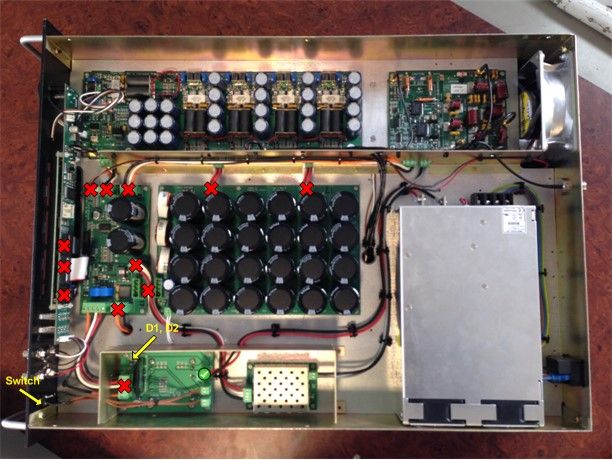

### Power Distribution

1. Insert the Phoenix connector into J6 on the Power Distribution Board. Insert the Special Test Cable (STC) into P2. Leave all other connections on the Power Distribution Board disconnected for now.
1. For reference the pins required on the STC are:
    * Pin 1 – Ground
	* Pin 19 and 20 TxRx (switching signal for PA and HPSW)
	* Pin 18 and 16 – 3.3V (50V enable, HV enable)
	* Pin 3 – Ground
1. Switch on the mains power and then switch on the 15V power.
1. Check D1 and D2 again on the DC Supply Board. If D1 does not light up or if D1 flashes then there is a fault on the Power Distribution Board. If this is the case, check that the thermistor is working as the inrush current to the capacitors C9 and C10 will trip the 15V supply if it is not limited by the thermistor. Otherwise you will have to fault find on the Power Distribution Board. The IC U2 and the 5V module are possible failure points as well as the regulators U1 and U3.
1. If all goes well, D1, D2 and D3 on the Power Distribution Board should light up as well as D8.
1. If D1 is off, check the 3.3V regulator U1; if D2 is off, check the 5V DC-DC converter; if D3 is off, the 15V line is faulty, so use the previous steps to debug. D8 is the fan controller, check U3.
1. Measure voltages on P1, P3 and P8 (3.3V, 5V and 15V) using a DMM. 3.3V±0.1V; 5V±0.2V and 14.6V is nominal.
1. Use 3.3V from the desktop power supply to turn on the relay via the STC and test the 50V on P9 (D4 should also light up when you do this).
1. Switch off the 15V from the front switch, plug in the fan on header P7, and switch on again. The fan should start up. Adjust potentiometer R35 to control the fan speed. If the fan does not start up, you likely have an inrush current problem or U3 is faulty.
1. If all is well, switch off from the front switch and move on to step 5.

###### Figure 6. Testing the power distribution board.
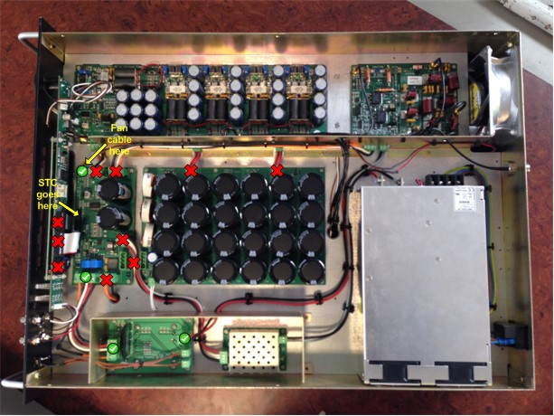

### Front Panel

1. Connect the ribbon cable P2 on the Front Panel to the Power Distribution Board. Power on.
1. There are three LED’s on the Front Panel, indicating voltages 15V, 5V and 3.3V. If one of the LED’s is off check the 5V or 3.3V regulators on the Front Panel. The 15V comes from the Power Distribution Board so a fault on the 15V line by now will be caused by the Front Panel Board so fault find there.
1. There is also one row of four LED’s on the front plate which should light up. The second row of LED’s should be off but may flash momentarily at switch on.
1. Scroll using the turn knob to the voltage screen on the Front Panel and check that the voltages are displaying. The voltages from the FPGA will be blank at this time. If any other voltages from the Power Distribution Board are missing then check the ribbon cable. Remember to apply 3.3V to the relay to see the 50V display.
1. Power off.
1. Now connect the remaining ribbon cables P3 and P5. Power up and check for faults. If a fault occurs after this then the problem is either with the Lantronix Board or the FPGA. The likely cause is a damaged ribbon cable, so check that first before continuing to fault find.
1. D1 on the Lantronix board should light up if all is OK.
1. Power off.

###### Figure 7. Testing the front panel board.
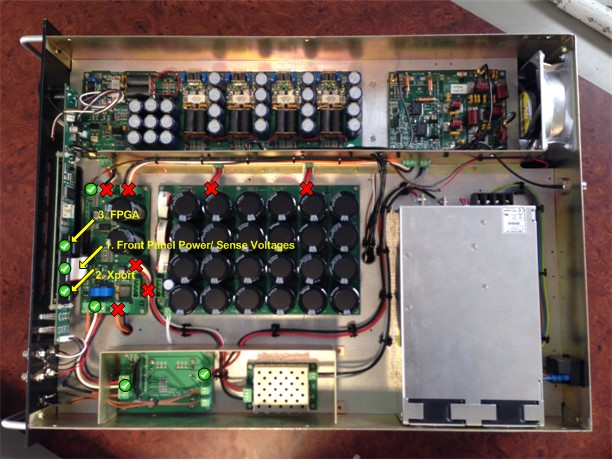

### Capacitor Farm

1. Connect the Phoenix connector between the Power Distribution Board (J3) and the Capacitor Board (J1).  Make sure that the discharge resistor is connected at J2 on the Capacitor Board.
1. Power on and apply the 3.3V signal to the STC. When 3.3V is applied the 50V will enable and D3 on the Capacitor Board will light up. Disconnect the 3.3V signal and D3 should start to dim. After approximately 15 to 20 seconds, D3 should be completely off.
1. If the Capacitor Board does not discharge, check the MOSFET, Q2. Also check that the relay has shut off the 50V supply.
1. Check that the Front Panel Board does not brown out and reset. If this happens, there is a problem with C9 and C10, they are not large enough or are not connected properly, check this with a continuity test.

###### Figure 8. Testing the capacitor board.
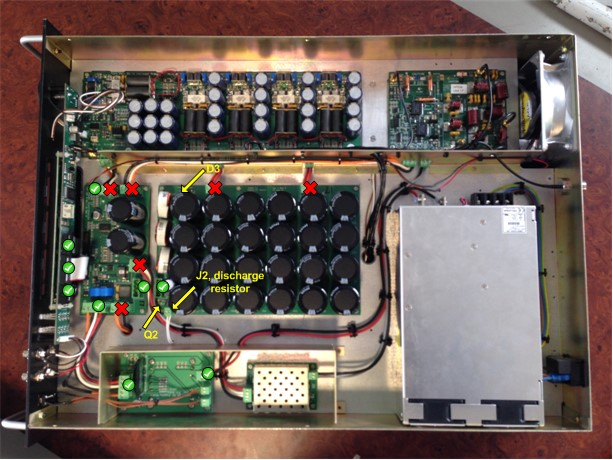

### High Power Switch

1. Switch on the AWG and set the frequency to 12.5 MHz and set the amplitude to 500mVp-p. Connect a BNC cable between the Output of the AWG and Channel 1 on the Agilent MSO6104A to view the waveform. Make sure to press ”Output” on the front face to enable the waveform. Remember to set the impedance of the channel to 50$\Omega$. Check that the waveform displayed is correct.
1. Connect the Special Test Cable (STC) to the “Tx/Rx” of the Radar Lab 2.0 via the BNC-connector and insert the other end into P2 of the Power Distribution Board. This will give us manual control over some of the FPGA functions needed for the tuning process.
1. For reference the pins required on the ribbon cable are:
	* Pin 1 – Ground
	* Pin 19 and 20 Tx/Rx (switching signal for PA and HPSW)
	* Pin 18 and 16 – 3.3V (50V enable, HV enable)
	* Pin 3 – Ground
1. Terminate the output at the antenna port with the 100W dummy load.
1. Make sure that the Phoenix connector J2 is removed from the HPSW. Replace it with a connection to the bench PSU. Set the PSU to 30V and limit the current to 1A.
1. Switch on the power of the transceiver box, the Radar Lab 2.0; as well as the 30V from the PSU to the HPSW.
1. Check that the Tx/Rx pulses are coming through on P5.
1. Check the TP_A is a replica of the Tx/Rx signal. If there is no waveform on TP_A, check that the CPLD is programmed. Otherwise, there is possibly a fault with the CPLD or its clock.
1. Check that P6 switch waveform goes from a DC off-set of about half of the 15V supply (7.5V) up to the HV supply voltage, which in this instance is set to 30V.
1. Power off.
1. Replace the 30V with the 1000V (reconnect the phoenix connector from the HV supply board). Switch on and check that P6 is now the switched 1000V.
1. Power off and return to 30V supply.
	###### Figure 9. First HPSW oscilloscope measurements.
	| 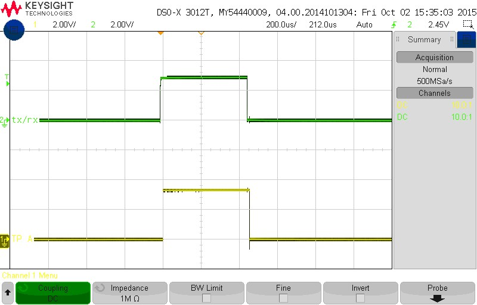 | 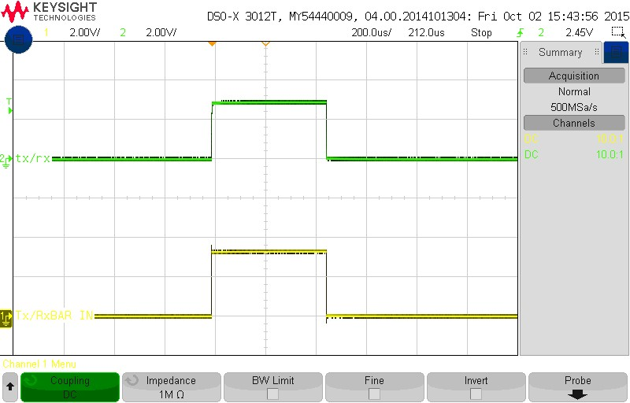 |
	| - | - |
	| 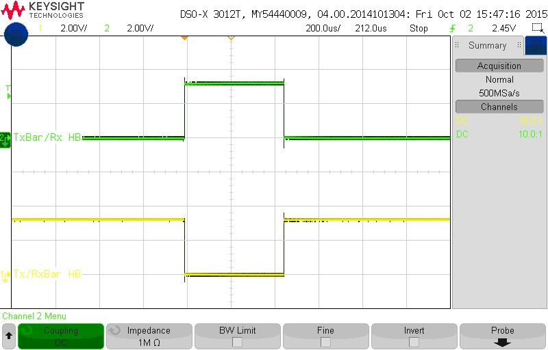 | 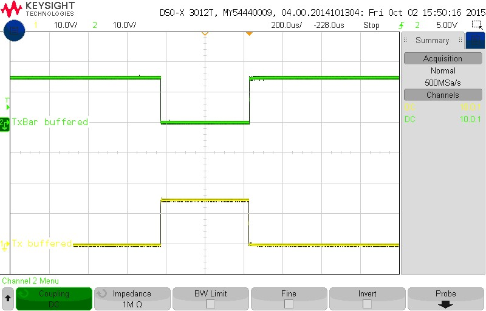 |
	|  | 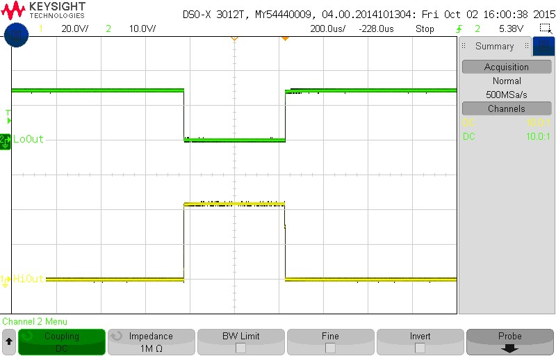 |
	| 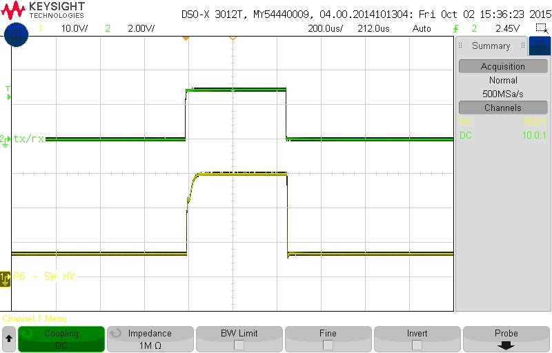 | 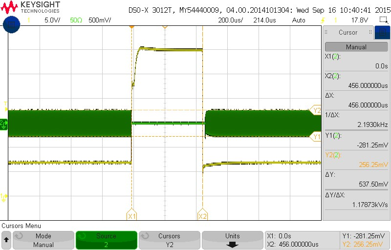 |
1. Remove the dummy load and connect the RF signal to the antenna port (12.5 MHz frequency and 0 dBm amplitude).
1. Make sure that you terminate the input port from the power amp or leave it connected to the power amp.
1. Power on.
1. Check that the signal from the antenna can be seen at the receive port, when the Tx/Rx switches low. You can also check that there is no leakage into the input port by terminating the receiver port and measuring on the input.
    ###### Figure 10. Second HPSW oscilloscope measurements.
    |  | 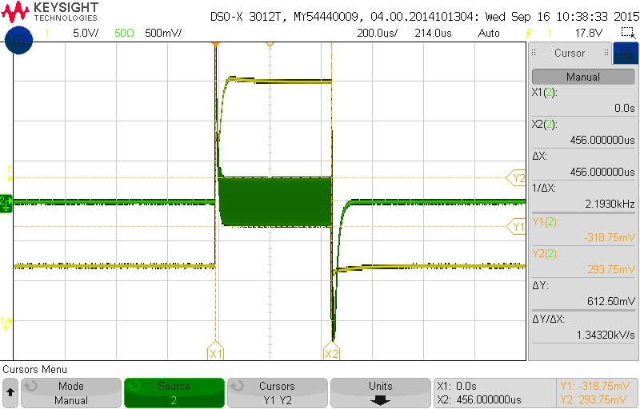 |
	| - | - |
1. Power off.
1. Terminate the receiver port.
1. Connect the RF signal to the input.
1. Power on.
1. Measure that the signal is getting through to the antenna port when the Tx/Rx signal is high. Also check that there is no leakage to the receiver by terminating the antenna port and measuring on the receiver port.
    ###### Figure 11. Third HPSW oscilloscope measurements.
    | 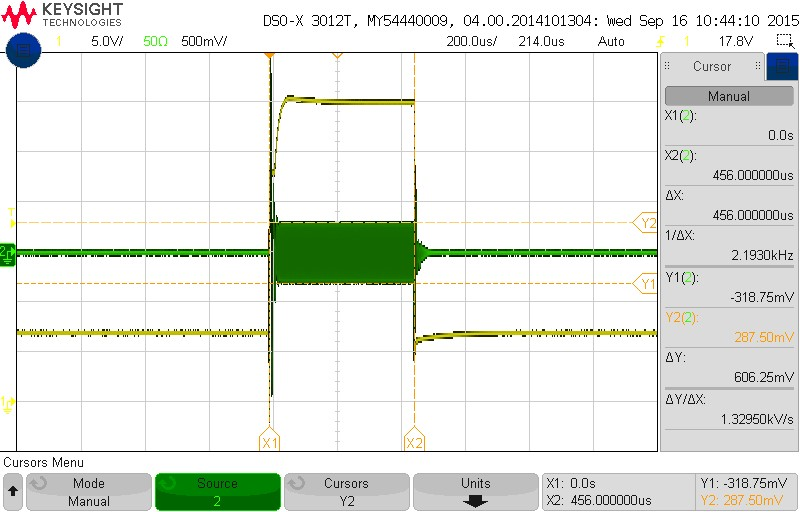 |  |
	| - | - |

Once you are comfortable with what needs to be terminated when, where and why you can also use this shortcut testing sequence:
1. Make sure that the Phoenix connector J2 is removed from the HPSW. Replace it with a connection to the bench PSU. Set the PSU to 30V and limit the current to 1A.
1. Connect the Rx and PWRAMP RF connectors each to a channel on the oscilloscope (Channel 2 & 3).
1. Remove the dummy load and connect the RF signal to the antenna port (12.5 MHz frequency and 0 dBm amplitude)
1.  Power up the transceiver box mains, then the front panel and then the 30 V PSU supply.
1.  Check the outputs at P5, P6 and TP_A (As described above).
1.  Now switch on the AWG output.
1.  Monitor the Rx and Tx signals on channel 2 & 3; make sure that both the channels are set to a 200mV scale on the oscilloscope and they should have more or less the same pk-pk voltages. If Rx is more than 75 mV less than Tx; the problem is most probably with a faulty limiter (D4). Test it and if needed replace it. Other regular known culprits to be investigated (if it is found not to be the limiter) are Q3 and Q4 mosfets, located at the bottom of the HPSW board.
1.  Switch off the output of the AWG; switch off the 30 V PSU supply; switch off the front panel; and then lastly switch off the transceiver box mains.
1.  Remove the RF signal and connect the dummy load to the antenna port.
1.  Remove the oscilloscope channel connectors from the Rx and PWRAMP RF connectors and plug all the normal RF circuit connections back in.
1.  Replace the 30 V PSU supply with the 1000V (reconnect the phoenix connector from the HV supply board).
1.  Switch on the transceiver box mains; switch on the front panel and then switch on the 3.3 V supply connected to the STC.
1.  Check that P6 is now the switched 1000V (REMEMBER to use the HV oscilloscope probe when measuring voltages fed from the HV Supply!) Switch everything off in reverse order of step 12.

### Power Amplifier

1.  Connect the Tx Env output of the Radar Lab 2.0 to the ‘pulse’ modulation input on the back of the AWG/signal generator(Modulation In) to generate the RF pulses.
1.  Connect the Tx/Rx signal from the Radar Lab to the STC in the FGPA header on the Power Distribution Board.
1.  Connect 3.3V from the bench PSU to the 50V enable and the HV supply enable to the FPGA header on the Power Distribution board (via the STC). – This step should already be done!
1.  Remove the 50V supply leads from the capacitor board and replace with 30V from the bench PSU. Limit the current initially to 1A.
1.  Switch on Radar Lab 2.0
1.  Turn all potentiometers anti-clockwise all the way so that there is no bias on the gates of the MOSFETS. (*** SHORTCUT: This step can be skipped. If this is not a brand new power amp you can leave the potentiometers where they are, as to save time when setting the bias point of the VRF MOSFETS, in later steps. However in the case of the replacement of a power amp, when dealing with a brand new power amp board, note that the potentiometers are most probably turned all the way anti-clockwise already so that there is no bias on the gates of the MOSFETS.)
1.  Perform the ‘auto-balance’ function of the current probe. (PS Ensure that the probe is in a closed/locked state! Output of the scope on the TxRx channel should also be set to 1 MΩ).
    ###### Figure 12. Power Amplifier test station setup.
	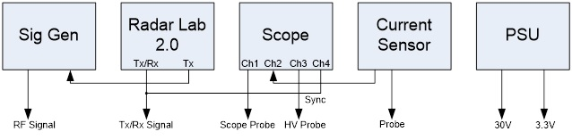
1.  Disconnect the HPSW from the Power Amp and terminate the output of the Power Amp (RF_OUT RF connector). with the dummy load.
1.  Switch on the transceiver box (mains) and Front Panel switch (15V) – NOT YET THE 30 V PSU SUPPLY!
1.  Check that the Tx/Rx signal is present on P1.
1.  Check that P12 is around 9.8V using the DMM.
1.  Remove the thermistor from P14 and P12 should increase by about 20mV. The shows that the thermal compensation is working. Plug the thermistor back in.
1.  Check that P10 is a switched version of P1.
1.  Check that J3 (the square hole connection) should be the inverse of P10.
    ###### Figure 13. P10 should be a switched 9.8V signal and J3 should be the inverse of P10.
	| 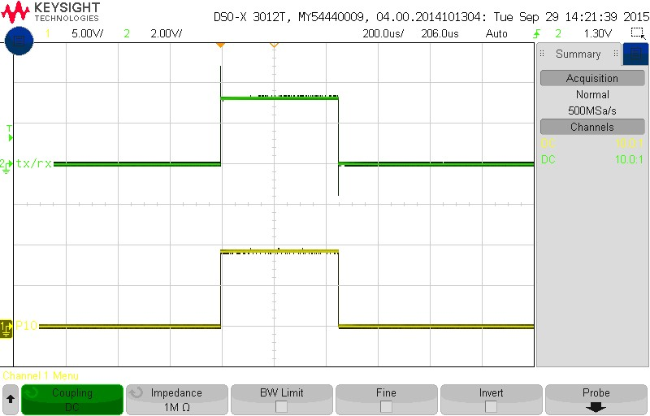 |  |
	| - | - |
1.  Check that Pin 5 of Q1 is a switched 12V signal. This powers the HELA10. Also check that J5 (pin1) is the inverse of Pin 5 of Q1.
    ###### Figure 14. Switched 12V to power the HELA10 and J5 should be the inverse of Q1 (pin5).
	| 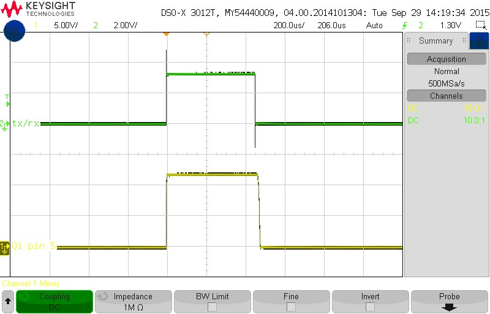 | 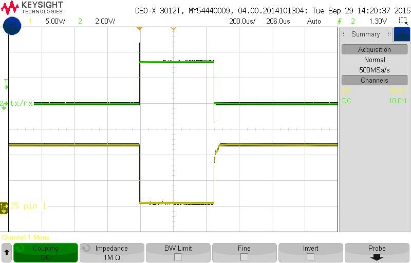 |
	| - | - |
1.  (Only applicable for brand new power amp boards.) Check that all the gates on the MOSFETS are at 0V. If not, check that the potentiometers are completely turned down.
1.  (Only applicable for brand new power amp boards.) Note: the gates are pre-biased using the potentiometers, onto which the drive pulse is added. This makes switching everything faster.
1.  (Only applicable for brand new power amp boards.) VRF MOSFETS pre-bias around 3.5V while the MRF MOSFETS pre-bias around 3V. The VRF part is better as it has more gain and a higher breakdown.
1.  Switch the 30V supply on.
1.  Attach the current probe to the copper wire bridge on the drain leads. Attach the scope probe to the corresponding test point on the MOSFET’s gate. Turn the potentiometer clockwise until you get close to the pre-bias point (3.5V). At this stage the current in the drain will start to rise when the Tx/Rx signal is high. Keep adjusting until the current pulse level is 200mA in the centre. The current pulse will at first be asymmetrical because there are two MOSFETS (adjust the first one to 100mA). Adjust the second MOSFETS gate voltage and monitor the current until you get 200mA current pulses its drain. Go back to the first drain and re-adjust to 200mA, if necessary. (*** Make sure that the scope probe measuring the pre-bias point (Voltage – “Yellow”) is set to 1MΩ and that the oscilloscope triggers on this channel. Also make sure that the scope probe measuring the current pulse level (Amps – “Blue”) is set to 1 M$\Omega$ as well.)
1.  Repeat the above step for all 5 pairs.
1.  At this stage the current should read about 350mA @ 30V (410mA @ 50V).
1.  Switch off the 30V supply.
1.  Now connect the RF signal to the input (RF_IN on the power amp board) with an amplitude of -20 dBm and a frequency of 12.5 MHz.
1.  Slowly increase the RF power up to 4 dBm.
1.  RF (TP_IN) should be around 1V pk-pk; the output of the HELA10 (C12 and C14) should be around 2V pk-pk each and balanced; the input of the MOSFETS (“G” - Gate) should be about 750mV pk-pk. This tells us that the HELA10 is working. (*** NOTE: At an amplitude of -20 dBm you don’t see anything on the oscilloscope immediately. Just start increasing the amplitude slowly whilst carefully monitoring it, until the RF signal is observed as described above.)
	###### Figure 15. Input RF signal (P3) at 4 dBm is roughly 1Vp-p, the voltage at the outputs of the HELA10 should be about 2Vp-p and the voltage at the gate of the driver amp MOSFET should be 750mVp-p.
	|  |  |
	| - | - |
	| 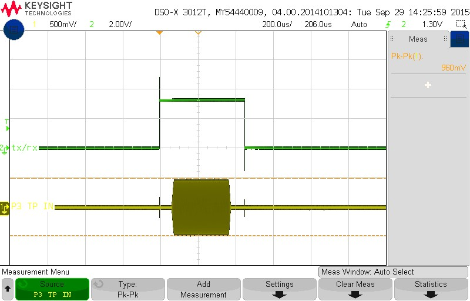 | |
1.  Turn the RF power back down to -20dBm. - IMPORTANT!
1.  Turn the 30V on again.
1.  Measure the output voltage at the Power Amp output (P20 – TP_OUT). It should read around 11V pk-pk.
    ###### Figure 16. When the input is -20 dBm the output (P20) reads 11Vp-p.
	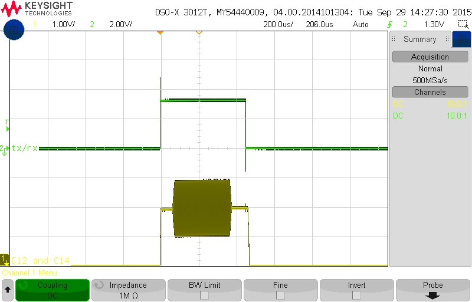
1.  Slowly increase the input power. Carefully monitoring the output voltage. You will need to increase the current limiting on the PSU. At 0dBm you should see about 130V pk-pk. Keep increasing until you reach 600V pk-pk, this should be at an amplitude of about 7 dBms.
	###### Figure 17. When the input is 0 dBm the output (P20) reads 130Vp-p. The output starts to saturate with an input signal of about 14dBm the output reads 600Vp-p.
	| 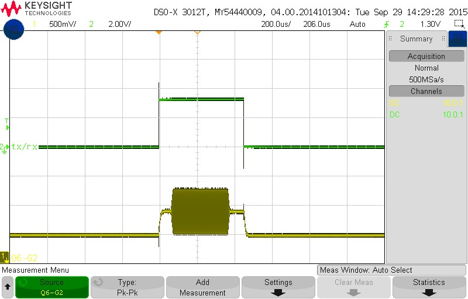 | 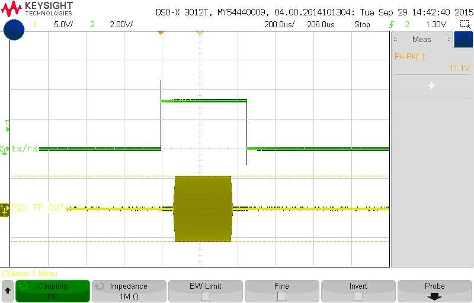 |
	| - | - |
1.  Now look at the drain voltages for each MOSFET. It should be somewhat symmetrical but the positive side will ramp up higher and there could be some slight ringing. Check the 3R3 damping resistors, if there is significant ringing.
    ###### Figure 18. Drain voltage at 30V supply at 600Vp-p output. Check that there is not significant ringing on the drains of the MOSFET's and that the voltage does not exceed 170V.
	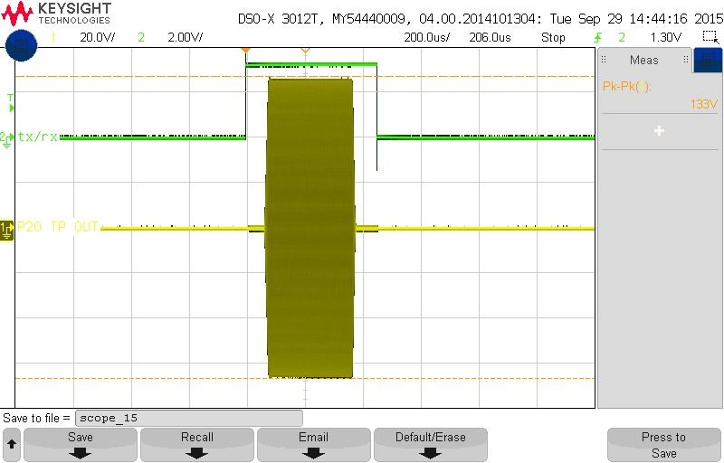
1.  Turn the RF power back down to -20dBm. - IMPORTANT!
1.  If everything is okay then power off.
1.  Replace the 30V supply with the 50V supply (from the capacitor board) and repeat the above process, starting from -20dBm again and increasing to 950V pk-pk (This should be observed at an amplitude of more or less 13 dBms). Re-check all the drain voltages. We do not want to exceed 170V for the VRF’s. A typical value will be around 120V at 950V pk-pk output. (If a drain voltage exceeds these values; the corresponding VRF Mosfet should be checked and most likely be replaced.) (*** ALTERNATE STEP 32 (including the HPSW and filter in the RF path): Un-terminate RF_OUT, terminate Rx on the HPSW and reconnect the HPSW and Filter to the power amp. Connect the 100 W dummy load to the antenna port and measure the output at the output pin of the filter board. Replace the 30V supply with the 50V supply (from the capacitor board) and repeat the above process, starting from -20dBm again and increasing to 950V pk-pk (This should be observed at an amplitude of more or less 13 dBms). Re-check all the drain voltages. We do not want to exceed 170V for the VRF’s. A typical value will be around 120V at 950V pk-pk output. (If a drain voltage exceeds these values; the corresponding VRF Mosfet should be checked and most likely be replaced.))
1.  Turn the RF power back down to -20dBm. - IMPORTANT!
1.  Power down everything in the correct sequence.
    ###### Figure 19. Drain voltage at 50V supply at 900Vp-p output.
	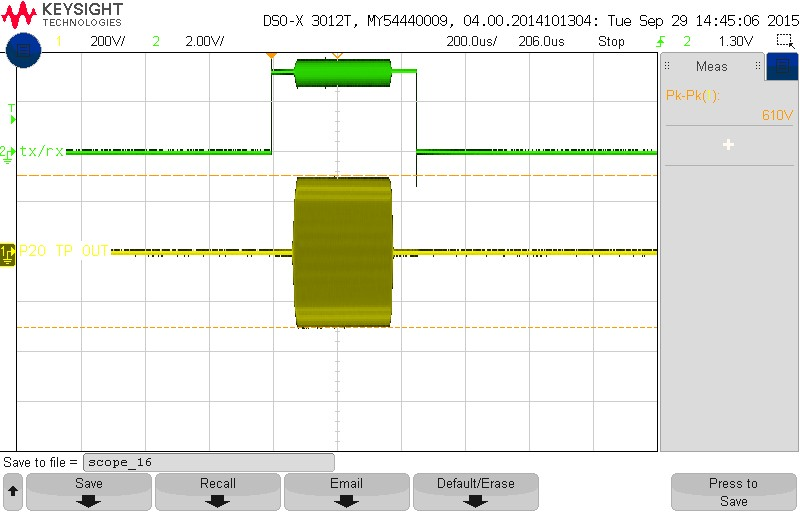

### FPGA

1.  Connect  Phoenix connector J4 to the Power Distribution Board.
1.  This will provide power to the FPGA board and the RF Transceiver Board. Re-check that the voltages are at 5V and 15V before proceeding.
1.  The FPGA Board has its own power regulation for all the different supply voltages it requires. The easiest way to check that these are all in order is to look on the Voltage Screen on the Front Panel. You can also check LED’s D9, D10, D11, D12 and D13. Fault finding will be difficult but try and check the DC-DC converter modules, if there is a problem with one of the voltages. For example 1.8V is mostly limited to the 1GIG Ethernet controller, so check there if there is an issue with 1.8V (this fault has happened before).
	###### Figure 20. Testing of FPGA and transceiver baord.
	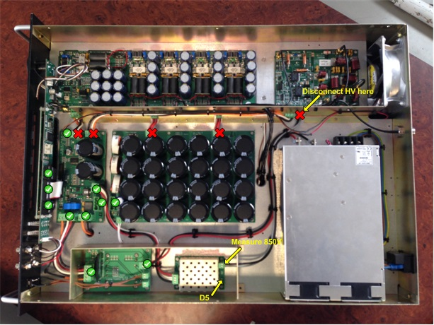

### RF Transceiver

1.  Connect the transceiver test board to the transceiver board and power it with 15 V from a test bench power supply.
1.  Verify that all 4 LEDs in the PWR LED bank on the transceiver test board are on.
1.  Verify that test pin P20 is at 10.5 V and P19 at 3.3 V on the transceiver board.
1.  Flip all of the switches on the transceiver test board on, one by one and verify that their corresponding LEDs respond accordingly (switch on and off when the switches are flipped).
1.  Switch on the AWG and set the frequency to 12.5 MHz and set the amplitude to 100mVp-p. Connect a BNC cable between the Output of the AWG and Channel 1 on the Agilent MSO6104A to view the waveform. Make sure to press “Output” on the front face to enable the waveform. Remember to set the impedance of the channel to 50$\Omega$ and use a 50$\Omega$ feed through connection on the oscilloscope channel being used. Check that the waveform displayed is correct.
1.  Connect the output of the AWG to the DAC2 port on the transceiver test board and Channel 1 on the Agilent MSO6104A to the DAC2_Out port on the transceiver board.
1.  Verify that the signal observed is the same 12.5 MHz, 100mVp-p signal with possible minor amplitude losses (~ 3 mV).
1.  Connect the output of the AWG to the DAC1(Tx) port on the transceiver test board and Channel 1 on the Agilent MSO6104A to the TxOUT port on the transceiver board.
1.  Verify that the signal observed is a 12.5 MHz, 25mVp-p signal. This is due to the Tx attenuator being set to maximum attenuation by default.
1.  Switch the LE (Latch Enable) of the Tx AGC bank on the transceiver test board on. This sets the Tx attenuator to minimum attenuation.
1.  Verify that the signal observed is a 12.5 MHz, 1Vp-p signal (800mV ~ 1V pk-pk).
1.  Switch through the attenuation switches in the Tx AGC bank on the transceiver test board one by one, starting at 1 dB all the way through to 16 dB. Verify after flipping each switch that the signal’s pk-pk amplitude decreases more and more with an increasing value of attenuation.
1.  Flip all the switches on the transceiver test board back to their original state (off).
1.  Connect the output of the AWG to the Antenna port on the transceiver board and Channel 1 on the Agilent MSO6104A to the MON2 port on the transceiver test board.
1.  Verify that the signal observed is the same 12.5 MHz, 100mVp-p signal with possible minor amplitude losses (~ 3 mV).
1.  Connect the output of the AWG to the Current port and terminate the Pwr_Amp port on the transceiver board and connect Channel 1 on the Agilent MSO6104A to the MON1 port on the transceiver test board.
1.  Verify that the signal observed is a 12.5 MHz, 70mVp-p signal with possible minor amplitude losses (~ 3 mV).
1.  Switch SWB on, on the transceiver test board.
1.  Verify that the signal observed is a 12.5 MHz, 50mVp-p signal with possible minor amplitude losses (~ 3 mV).
1.  Switch the power off.
1.  Connect the output of the AWG to the Pwr_Amp port and terminate the Current port on the transceiver board and connect Channel 1 on the Agilent MSO6104A to the MON1 port on the transceiver test board.
1.  Switch the power on.
1.  Verify that the signal observed is a 12.5 MHz, 50mVp-p signal with possible minor amplitude losses (~ 3 mV).
1.  Switch SWB off, on the transceiver test board.
1.  Verify that no signal is measured at the MON1 output port.
1.  Change the amplitude on the AWG to 1mVp-p as the amplification on the Rx signal path is very large and one does not want the output of the receiver to be more than 1V pk-pk.
1.  Connect the output of the AWG to the RFin port on the transceiver board. Connect Channel 1 on the Agilent MSO6104A to the ADC(Rx) port and terminate the DAC1(Tx) port, on the transceiver test board.
1.  Switch the LE (Latch Enable) of the Rx AGC bank on the transceiver test board on. This sets the Rx attenuator to minimum attenuation.
1.  Verify that the signal observed is a 12.5 MHz, 1Vp-p signal (800mV \~ 1V pk-pk).
1.  Switch through the attenuation switches in the Rx AGC bank on the transceiver test board one by one, starting at 1 dB all the way through to 16 dB. Verify after flipping each switch that the signal’s pk-pk amplitude decreases more and more with an increasing value of attenuation.
1.  Flip all the switches on the transceiver test board back to their original state (off).
1.  Switch the power off.
1.  Connect the output of the AWG to the DAC1(Tx) port and connect Channel 1 on the Agilent MSO6104A to the ADC(Rx) port on the transceiver test board and terminate the RFin port on the transceiver board.
1.  Change the amplitude on the AWG to 50mVp-p.
1.  Switch on the LE (Latch Enable) switches in the Tx AGC and Rx AGC banks on the transceiver test board.
1.  Switch SWA on, on the transceiver test board.
1.  Switch the power on.
1.  Verify that the signal observed is a 12.5 MHz, 1Vp-p signal (800mV ~ 1V pk-pk).
1.  Switch SWA off, on the transceiver test board.
1.  Verify that no signal is measured at the ADC(Rx) port on the transceiver test board.

Once you are comfortable with what needs to be terminated when, where and why you can use the following shortcut test sequence for the transceiver board. Make sure that the oscilloscope is setup to trigger on the channel being used to measure and test on! And ZOOM in on the oscilloscope as the signals being measured in this test are mostly all very small.

1.  Disconnect the transceiver board from the FPGA and unmount from the chassis.
1.  Connect the transceiver board to the “RF Transceiver Test Board Ver 1.2” and power this setup with an external 15 V from a bench power supply.
1.  Switch the power on and make sure all 4 power LEDs on the tester board light up; and that each LED corresponding to a DIP switch, switches on when the switch is turned on.
1.  Switch all switches off again.
1.  Switch on the AWG and set the frequency to 12.5 MHz and set the amplitude to 100mVp-p.
1.  Connect the output of the AWG to the DAC2 port and observe the same signal as output on DAC2_OUT.
1.  Connect the output of the AWG to the DAC1(Tx) port and observe a signal with an amplitude of ± 25 mV pk-pk on Tx_OUT.
1.  Flip the TxAGC (LE) switch on and observe a signal with an amplitude of ± 800 mV pk-pk on Tx_OUT.
1.  Flip the other TxAGC (1dB – 16dB) switches on one by one and observe an increasing attenuation of the signal on Tx_OUT, corresponding to flipping the switches of increasing dBs.
1.  Connect the output of the AWG to the Antenna port and observe the same signal as output on MON2.
1.  Connect the output of the AWG to the Current port and terminate the PwrAmp port; observe a signal with an amplitude of ± 70 mV pk-pk on MON1.
1.  Flip SWB switch on and observe the signal on MON1 drop in amplitude to ± 50 mV pk-pk.
1.  Switch the power off and swap the inputs to the Current and Pwr_Amp ports
1.  Switch the power back on and verify once more a signal with an amplitude of ± 50 mV pk-pk on MON1.
1.  Flip SWB switch off and observe the signal on MON1 disappear. Flip SWB switch on and back off again, watching the signal with an amplitude ± 50 mV pk-pk re-appear and disappear again on MON1.
1.  Power off and change the AWG output from 100 mV pk-pk to 1 mV pk-pk.
1.  Connect the output of the AWG to the RFin port and terminate the DAC1(Tx) port; observe the same signal output on ADC(Rx).
1.  Flip the RxAGC (LE) switch on.
1.  Power up the tester board and output the AWG; observe a signal with an amplitude of ± 800 mV pk-pk on ADC(Rx).
1.  Flip the other RxAGC (1dB – 16dB) switches on one by one and observe an increasing attenuation of the signal on ADC(Rx), corresponding to flipping the switches of increasing dBs.

### Transmit and Receive Tests

###### Figure 21. Setup of transceiver box, timing box, oscilloscope and server.
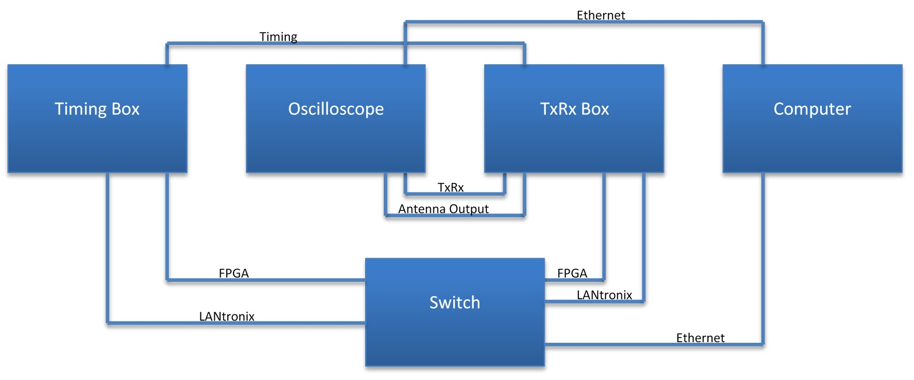

1.  Ensure all cables are plugged in; And the dummy load is connected to the antenna port
1.  On the computer (Joshua) go to /T3/cpart/ [Run command: cd /T3/cpart/]
1.  Run ./sop
1.  Ensure that there are 2 boxes alive (Timing box and Transceiver box being tested)
1.  Enter 1 for transmit test, then 3 to transmit
1.  You should hear the box switching and see the TxRx signal as well as the antenna output (500Vp-p) on the oscilloscope
1.  To stop the test, enter 5 for the receive test, replace the dummy load with AWG set to 9.9MHz @ 1mVp-p
1.  Run ./sop again and enter 0, then 3 to begin
1.  When you switch on the AWG you should see a waveform on the computer with amplitude 30 000 peak-to-peak
1.  To stop the test, enter 5

### Calibration

1.  For the calibration, replace the AWG input with the dummy load
1.  Run ./sop and enter 1, then 3 to transmit
1.  Once you hear the switching, press 4 to enter calibration
1.  Enter the box node number you wish to calibrate
1.  Once calibration is complete, do another transmit test and confirm antenna output is 500Vp-p