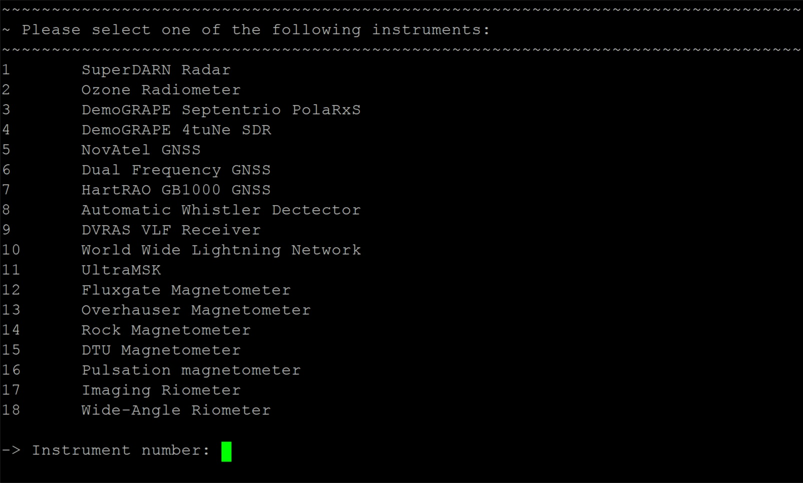
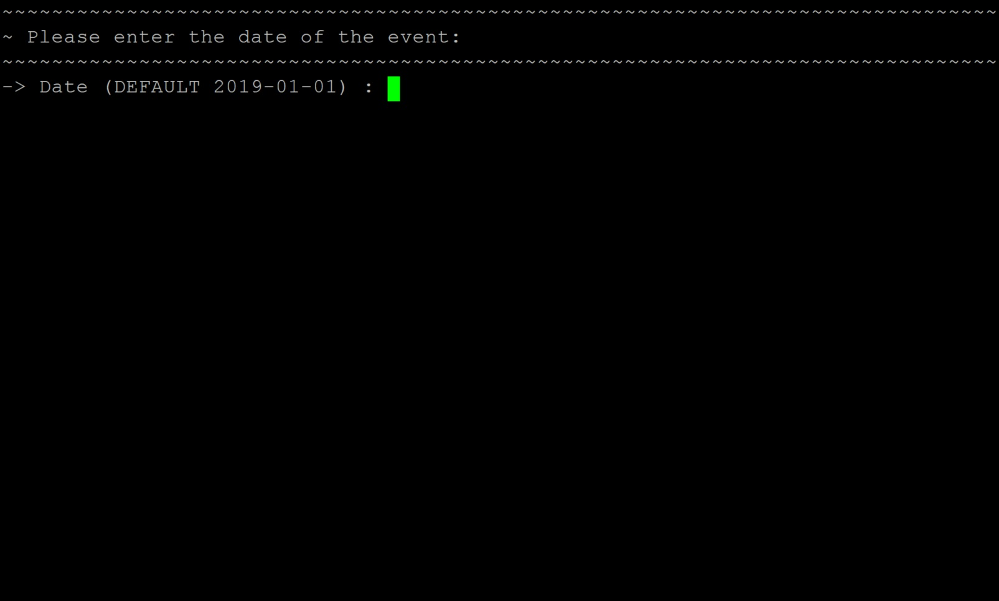
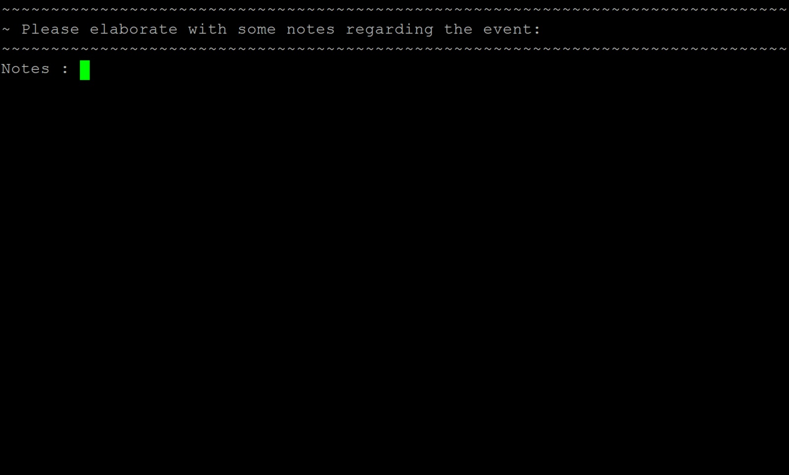
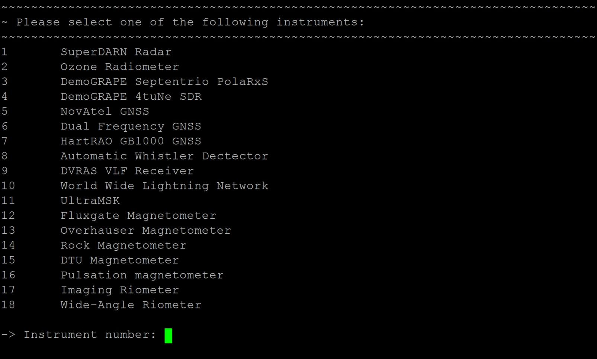
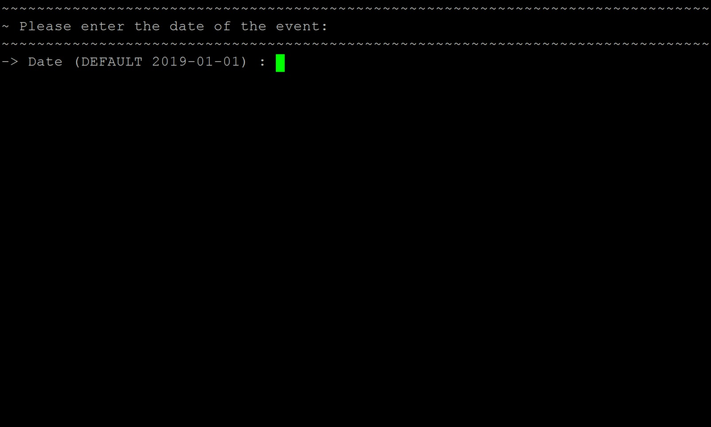

# Standard Operating Procedures
This section provides a guide for the radar's day-to-day operation and maintenance. [Summary](#summary) provides all the details necessary to locate and access the instrument's system. [Daily Checks](#daily-checks) lists all items that need to be checked on a daily basis to ensure that the system is still operating properly. [Procedures](#procedures) explains the basic operating procedures for the system. [Monitoring](#monitoring) shows how the Grafana monitoring system interacts with the instrument's local server and [Reporting](#reporting) elaborates on how to generate monthly reports for the system.

When unsure about any of the automated tasks, just run this command: `crontab -l` to see which scripts are being run, where they're located and at what times they are set to execute.

## Summary
The tables below gives a summary of all the details necessary to locate, access and maintain the instrument's system.

###### Table 1. System details - Login
| Item | Description |
| ---- | ----------- |
| Internal IP Address | 172.17.31.50 |
| External IP Address | 155.232.186.23 |
| User Name | radar |
| Password | sanaeradar |

###### Table 2. System details - Details
| Item | Description |
| ---- | ----------- |
| Machine | SuperMICRO |
| Operating System | Ubuntu 14.04 |
| Instrument | SuperDARN HF Radar |
| NTP Serer | 172.17.30.8 |
| Location | Radar Hut |

###### Table 3. System details - Principle Investigator
| Item | Description |
| ---- | ----------- |
| Name | Judy Stephenson |
| Email Address | judes.stephenson@gmail.com |
| Affiliation | University of Kwa-Zulu Natal |

## Daily checks
Check the following at least once every day to ensure that the radar is working properly:
- Navigate to `/data/ros/fitacf/` and confirm that the latest data file is growing.
- Run the command: `screen -x`. Verify that the radar software is running.
- Use SCP and log into the SANRAD server. Make sure that the previous day's data transferred correctly. The transfer script is located at `/home/radar/transfer_data/script/sanrad_new`.
- The size of daily data files can vary, but should be between 10MB and 20MB, more or less. Very small data files might be a sign that the radar is running at low power.-

## Procedures
This section provides instructions on how to stop and start the radar software properly.

Smart Power Distribution Units can be accessed remotely to power cycle a specific port in the case of a single box giving problems. See below for instructions on how to do this.

### Stopping the Radar Software
To properly and safely switch off the radar, follow these steps:
1. Run this command in any terminal on the radar server: `stop.radar`.
1. Log the activity using the logging script.

### Starting the Radar Software
To start the radar properly, follow these steps:
1. Navigate to the directory: `/home/radar/T3/cpart/`.
1. To test the operation of the radar, run this command: `./sop`.
1. Choose 1 to select the transmit test.
1. Choose 3 to start transmitting.
1. Verify on the transceiver boxes that they all have antenna voltages in the range of 300V - 500V and that their sequence counts are increasing.
1. Choose 5 to stop the test.
1. Press ctrl-c to exit the test program.
1. Run `./sop` again to reset the tansceiver boxes' sequence counts.
1. Press ctrl-c again.
1. Ping each of the radar boxes to ensure that their front panels are all functional.
1. Open a screen session with the command: `screen`, or enter an existing screen session with: `screen -x`.
1. Run the command: `start.radar` in the screen session.
1. Exit the screen session using: `ctrl-a` and then `d` if the radar server is being accessed remotely.
1. Log the activity on using the logging script.
1. Wait until all of the beams have been scanned at least twice, since the software often stops with the error: "No pending program." during the first scan.

### Power Cycling the Entire Radar
The following steps can be used to completely shut down the radar:
1. Stop the radar software.
1. Switch off all of the radar transceiver boxes and the timing box from the front panels.
1. Switch off the radar server with the command: `sudo poweroff now`.

To switch the radar on again, follow these steps:
1. Switch the radar server on again at the power button. Wait for the server to boot up.
1. Switch on the timing box and then all of the transceiver boxes. Only switch on one transceiver box at a time for the same PDU, since switching all of them on at the same time will require a sudden surge of current to be supplied.
1. Start the radar software.

### Power cycling a specific port on the PDU
To power cycle a specific port on the PDU, follow these steps:
1. Stop the radar software first, if it wasn't already.
1. Run the script: `SANAE_PDU_Control.sh`. Follow the instructions provided by the script.

Alternatively, the PDU's can be accessed directly using a browser and navigating to the desired IP address. Use the following information to log in and adjust the settings for:
1. PDU IP range: 172.17.30.20-25
1. User name: apc
1. Password: apc

PDU Gateway: 172.17.30.10 (Used as keep-alive address)

| ID | IP | P1 | P2 | P3 | P4 | P5 | P6 | P7 | P8 |
| -- | -- | -- | -- | -- | -- | -- | -- | -- | -- |
| PDU1 | 172.17.30.20 | SW1 | NC | NC | NC | M4 | M3 | M2 | M1 |
| PDU2 | 172.17.30.21 | S2 | S1 | M8 | M7 | M6 | M5 | NC | NC |
| PDU3 | 172.17.30.22 | C2 | C1 | J1 | J2 | SW3 | T1 | Sc | SW2 |
| PDU4 | 172.17.30.23 | NC | NC | NC | NC | M12 | M11 | M10 | M9 |
| PDU5 | 172.17.30.24 | S4 | S3 | M16 | M15 | M14 | M13 | MP | NC |
| PDU6 | 172.17.30.25 | - | - | - | - | - | - | - | - | - |

- M1-M16 : Main Array Transceiver boxes.
- S1-S4 : Secondary Array Transceiver box (Currently not connected).
- T1 : Timing box 2 (Timing box 1 is faulty).
- J1-J2 : Joshua, main server. Redundant power supply.
- C1-C2 : Caleb, back-up server. Redundant power supply.
- SW1 : 8 port switch (fiber connection to base).
- SW2 : 20 control switch, 20 port data switch, Microtik router.
- SW3 : Fiber-Ethernet converters and 8 port D-link switch.
- Sc : Rack Screen.
- MP : Multi-plug.

## Activity Logging
A logging system for all of the instruments on base was implemented in 2018. The logging scripts and data can be found on the data server. Any activities or disturbances to any of the instruments should be logged using this system.

Data that is entered using the logging script is synced with the instrument PC as well as being fed into the influxDB database. From there the log entries can then be displayed live on the Grafana dashboards and read into the monthly reports automatically.

In case an entry needs to be deleted, a separate script needs to be run. This script will then delete the entry from the data server, instrument PC and the influxDB database. This section provides detailed instructions for logging entries, deleting entries and adding new systems.

## Logging an Activity
To log a new activity, run the script: `log.sh` and follow the instructions, as demonstrated by the following steps:

1. First, the script will display an enumerated list of all the registered systems. It will then prompt for an instrument number, corresponding to the instrument on which the activity is to be logged. Enter the number and then press the `Enter` key.
    ###### Figure 1. Logging a new activity: Step 1.
    

1. The next prompt will ask for the name of the person responsible. A default name is displayed, which is read from the universal configuration file. To select the default option provided, simply press the `Enter` key. If the default name is incorrect, type in the desired name and press `Enter`.
    ###### Figure 2. Logging a new activity: Step 2.
    

1. When asked for the date, once again a default value is displayed. The default date is that of the present day and if the event occurred on a previous day, that date should be entered in the correct format.
    ###### Figure 3. Logging a new activity: Step 3.
    

1. The time is then prompted, once again with the current time as default. Press `Enter` or type in the desired time for the event.

    ###### Figure 4. Logging a new activity: Step 4.
    

1. The new status of the system can then be selected from a list of options. These include 0 (the system is off and no data is being logged), 1 (the system is logging data, but interference caused it to be invalid) and 2 (the system is up and logging valid data). Select one of these options and press `Enter`.

    ###### Figure 5. Logging a new activity: Step 5.
    

1. Finally, the user is asked to elaborate on the reason behind the event. Provide as much information as possible, typing in full sentences. Avoid using special characters as part of this entry. When done, press `Enter` and wait for the logs to be synchronized and uploaded to the influxDB database.

    ###### Figure 6. Logging a new activity: Step 6.
    

### Deleting an Activity
To delete a faulty activity entry, run the script: `del.sh` and follow the instructions, as demonstrated by the following steps:

1. First, the script will display an enumerated list of all the registered systems. It will then prompt for an instrument number, corresponding to the instrument on which the activity is to be logged. Enter the number and then press the `Enter` key.

    ###### Figure 7. Deleting an activity: Step 1.
    

1. When asked for the date, once again a default value is displayed. The default date is that of the present day and if the event occurred on a previous day, that date should be entered in the correct format.

    ###### Figure 8. Deleting an activity: Step 2.
    

1. The script will then display an enumerated list of all the activities logged for the date previously specified. Enter the number corresponding to the faulty entry and press `Entry` to delete that entry. Wait for the logs to be synchronized with the instrument PC and influxDB database.

    ###### Figure 9 Deleting an activity: Step 3.
    

### Adding a New Instrument

## Monitoring
A live monitoring system for all of the instruments on base have been implemented in Grafana, working with an InfluxDB back-end. This section explains how this system works, from the data collection scripts, reading data into the InfluxDB databases and displaying the data and statistics on a Grafana dashboard.

### Overview
For each system, data is transferred to the data server at set intervals. These intervals can be seen and set in the crontab of the data server. The data collector script, which is called by the crontab, runs a datacrawler script on the instrument PC via ssh. These datacrawlers are responsible for reading the most recent data and formatting it to comply with the influxDB Line Protocol. The file containing the database entries is then transferred to data server, from where it is read into the influxDB database. Refer to \figref{ops_monitoring} below.

###### Figure 10. Monitoring System Overview.

Graph and explanation of datacollector, datacrawler, influx, grafana, etc.

### Scripts
### Backfilling
### InfluxDB
### Grafana

scripts, data, backfilling, influx commands, retention policy

## Reporting
script and how to copy to desktop. (Luatex for memory problems)