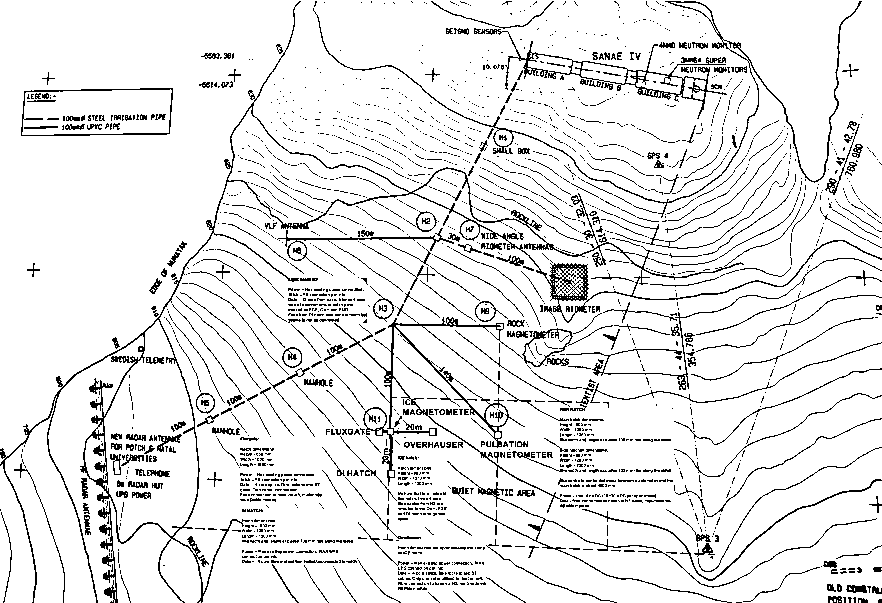
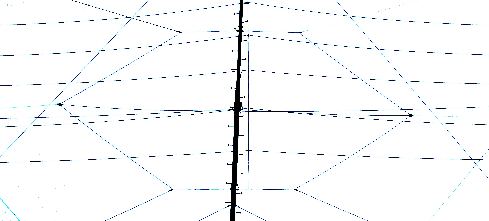
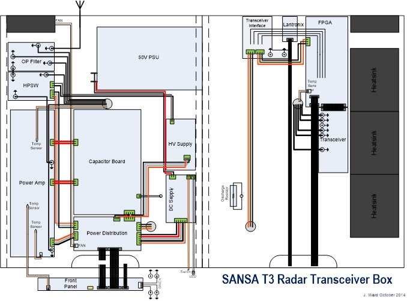

# SuperDARN HF Radar
## Operations and Maintenance

### Introduction
This manual serves as a comprehensive guide on operating and maintaining the SuperDARN high frequency radar at SANAE IV. This section of the manual provides a concise background on the SuperDARN Radar, how it works and what it looks for.

#### Infrastructure Overview
The infrastructure of the radar and the maintenance thereof is discussed in depth in [Introduction](#introduction). The radar's infrastructure consist of 20 antenna masts and a hut which houses all of the radar's transceiver and server equipment, as well as the network and electricity connection to the base infrastructure.

The radar hut is located about 600m South-East of the base at the center of the main antenna array, as shown in [Figure 1](#figure-1-site-map). There is a lifeline stretching from the base to the radar hut, as indicated on the map in \figref{intro_map}.

###### Figure 1. Site Map

Electricity is relayed from the base to the radar hut, from where it is also distributed to the small satellite dome where the ozone radiometer is located. The power is not connected to the base UPS's, so the radar has its own small UPS. For more information on the radar hut, refer to [Hut](#hut).

There is 20 antenna masts forming part of the radar infrastructure on which the antennas are mounted. See \subsecref{infra_masts} for more details on the maintenance and climbing of these masts.

#### Hardware Overview
The hardware of the radar and the maintenance thereof is discussed in depth in \secref{hardware}. The radar has a main antenna array consisting of 16 antennas and a secondary array with 4 antennas. Each of these antennas is driven by a transceiver box, interconnected by the radar's server network.

The antennas are hexagonal and consist of two halves, as shown in \figref{intro_antenna} below. \subsecref{hw_antennas} provides more details on the construction and maintenance of the antennas.

\subsecref{hw_boxes} provides step-for-step instructions on the servicing and maintenance of the radar's transceiver boxes. \figref{intro_box} shows the basic layout for the front and back of a radar transceiver box.

The configuration of the server and network setup is demonstrated in the diagram shown in \figref{intro_hw}. The local radar network consists of a timing, control and monitoring network. The server is also connected to the base's science network and thus also the internet. More details concerning the maintenance of the server network can be found in \subsecref{hw_network}.

###### Radar transceiver box layout

##### Network layout of the radar hardware

#### Software Overview
The radar's various software components are discussed in depth in \secref{software}. The radar has several components that requires their own specialized software:
\begin{itemize}
	\item RST - Radar control software installed on the radar server
	\item VHDL code installed on the T3 FPGA Board
	\item C Code installed on the Front Panel processor
	\item VHDL code installed on the HPSW FPGA
\end{itemize}

The RST software is mostly written in C and was developed to produce a standard data product for all SuperDARN radars. All of the source code is available, but rarely gets updated or changed. See \subsecref{sw_rst} for more information.

The VHDL source code for the T3 FPGA board isn't fully available, but is currently being adapted to allow for operation of the secondary array too. The file for reprogramming the board is available, should one of them start giving problems. See \subsecref{sw_fpga} for more details.

C code for the Front Panel's Zilog processor is available and will need to be updated from time to time. This code is responsible for monitoring the state of each transceiver box: On the Front Panel LCD as well as remotely via the server's monitoring network. Refer to \subsecref{sw_fp} for more details.

The high power switches have a small CPLD installed on them for monitoring, control and communication purposes. The VHDL code for these chips are available, but shouldn't require any changes. Should one of the boards give problems, they can be reprogrammed. Refer to \subsecref{sw_hpsw} for more details.

#### Standard Operating Procedure Overview
[Operations](#) gives detailed information about the standard operating procedure for the radar. This includes instructions for daily checks to be performed, operating the radar, monitoring the radar's performance and generating monthly reports.

\subsecref{ops_summary}, \subsecref{ops_dailychecks} and \subsecref{ops_procedures} provide all of the information necessary for the radar's everyday operations.

\subsecref{ops_monitoring} provides details on the remote monitoring system implemented for all of the instruments. The Grafana monitoring software works on an influxDB back-end.

\subsecref{ops_reporting} gives instructions and information on the automatic reporting software used to generate a skeleton for each monthly report.

\section{Infrastructure}
\label{sec:infrastructure}
The static infrastructure of the radar consists mainly of the radar hut and the 20 antenna masts with their stay ropes.
\par
The radar hut contains emergency supplies, climbing gear, tools, various spare parts for the radar and has electricity relayed to it from the base.
\par
Each antenna mast has eight stay ropes that keeps it upright. These ropes break from time to time and then needs to be repaired or replaced.

#### Radar Hut
This section provides instructions for the maintenance of the radar hut and inventory lists of its contents.

The radar hut consists of two compartments: The lobby and the radar room, separated by a door. The lobby contains most of the supplies, while the radar room contains the radar hardware and a cabinet of some smaller spare components, stationary and miscellaneous items.

##### Emergency Supplies
The radar hut is located about 600m from the base. This means that one can get stuck there if the weather changes abruptly and becomes unfavorable for traveling back to the base. Thus, the hut is stocked with emergency supplies for this eventuality. Supplies for medical emergencies are also necessary since the base is so far away.

It is the responsibility of the overwintering radar engineer to see that these supplies are always up to standard and not expired. See \tabref{infra_supplies} below for a comprehensive list of all supplies that need to be in the radar hut at all times:

###### Table 1. Radar Hut Emergency Supplies - Food
| Item | Description | Quantity |
| ---- | ----------- | -------- |
| | FOOD | |
| Water | There is a dispenser in the hut. It needs to be cleaned and refilled regularly. | 20 Liters |
| Canned Food | A variety with mostly instant meals is preferable. Check expiry dates. | 10 Cans |
| Instant Soup | A variety is preferable. Check expirty dates. | 10 Packs |
| Biscuits | Provitas, rusks, crackers, etc. Check expiry dates. | 4 Packs |
| Fruit Bars | A variety is preferable. Check expiry dates. | 1 Box |
| Dried Fruit | A variety is prefarable. Check expirty dates. | 2 Packs |
| Coffee | Instant coffee powder. | 500 g |
| Tea | Rooibos and English | 20 bags |
| Condensed Milk | Sweetened | 3 Cans |
| Game | Energy drink for electrolytes. | 1 Can |

###### Table 2. Radar Hut Emergency Supplies - Utensils
| Item | Description | Quantity |
| ---- | ----------- | -------- |
| | UTENSILS | |
| Electric Kettle | Check regularly if it's in a working condition | 1 |
| Stove | Small electric stove, check if working | 1 |
| Plate | Check on condition. | 2 |
| Cup | Check condition | 2 |
| Other | Knives, forks, spoons, etc. | 2 of Each |

###### Table 3. Radar Hut Emergency Supplies - Bedding
| Item | Description | Quantity |
| ---- | ----------- | -------- |
| | BEDDING | |
| Mattress | Folded Mattress | 1 |
| Sleeping Bag | Clean before takeover | 1 |
| Pillow | New covers before takeover | 2 |

###### Table 4. Radar Hut Emergency Supplies - Medical
| Item | Description | Quantity |
| ---- | ----------- | -------- |
| | MEDICAL | |
| Medical Aid Kit | Give to doctor for restocking before takeover | 1 |
| Sunscreen | Check quantities | 2 tubes |
| Hand warmers | Unopened | 4 pairs |

Furthermore, the fire extinguisher should also be checked on a regular basis. Make sure that the extinguisher is refilled during takeover when the DPW is servicing the rest of the fire extinguishers on base.

##### Climbing Gear
Climbing gear for antenna maintenance is kept in the radar hut as well. This gear should be inspected on a regular basis according to standards provided during the working at heights training in Cape Town.

It is the responsibility of the overwintering radar engineer to ensure that the climbing gear is always ready to go and well maintained. See \tabref{infra_gear} for a list of all equipment that needs to be available.

###### Table 5. Radar Hut Climbing Gear
| Item | Description | Quantity |
| ---- | ----------- | -------- |
| Rescue Bag | Smaller red tarp bag. | 1 |
| Dynamic climbing rope | Properly coiled in the red bag | 1 |
| Ratchet or jag system | Make sure they're in a working condition | 1 |
| Descender | - | 1 |

	Rescue bag & Smaller red tarp bag. & 1 \\\hline
	Dynamic climbing rope & Properly coiled in the red bag. & 1 \\\hline
	Ratchet or jag system & Make sure they're in a working condition. & 1 \\\hline
	Descender & - & 1 \\\hline
	Temporary slings & - & 2 \\\hline
	Carabiners & Attached to the slings & 4 \\\hline
	\multicolumn{3}{|l|}{\cellcolor{main!20}\textbf{2 Climbing sets}} \\\hline
	Helmet & Check that their in good condition. & 1 per set \\\hline
	Full harness & Inspect regularly. & 1 per set \\\hline
	Work belt & (Or 2 cow tails) Check condition. & 1 per set \\\hline
	Shock absorbing lanyard & Check condition. Use carabiners instead of hooks to prevent slipping off of ladder rungs. & 1 per set \\\hline
	Carabiners & For any other gear/equipment needed. & 4 per set \\\hline
	\multicolumn{3}{|l|}{\cellcolor{main!20}\textbf{Other}} \\\hline
	Big red bag & Contains climbing sets and spares. & 1 \\\hline
	Climbing hooks & Not used, but could come in handy. & 4 \\\hline
	Descenders & Various types. & 4 \\\hline
	Ratchet & Spare for rescue set. & 1 \\\hline
	Shock absorbing lanyards & Various types and lengths. & 4 \\\hline
	Slings & Various lengths & 4 \\\hline
	Adjustable work belt & - & 1 \\\hline
	Carabiners & Spares & 5 \\\hline
	Jag system & Spare for rescue set. & 1 \\\hline
	Climbing sling & - & 1 \\\hline
	Helmet & Spare & 1 \\\hline
\end{longtabu}
\par
Otherwise, there are also a whole pile of old ropes removed from the radar that can be used as go-ropes. Be sure to take one with for climbing, this makes help from the ground much easier.
\par
\figref{infra_rescue} shows what a rescue set should look like and what it should include.
\begin{figure}[H]
	\centering
	\includegraphics[height=5cm]{images/infrastructure/rescue.jpg}
	\includegraphics[height=5cm]{images/infrastructure/rescue_content.jpg}
	\caption{A rescue set and its content.}
	\label{fig:infra_rescue}
\end{figure}
\par
\figref{infra_climbing} shows what the climbing gear bag should look like and what it should include.
\begin{figure}[H]
	\centering
	\includegraphics[height=5cm]{images/infrastructure/climbing.jpg}
	\includegraphics[height=5cm]{images/infrastructure/climbing_content.jpg}
	\caption{The climbing bag and its contents.}
	\label{fig:infra_climbing}
\end{figure}
\par
\figref{infra_set} shows what a climbing set should look like and what it should include. There are hooks in the radar hut where these can be hung to make it quicker to get ready for climbing.
\begin{figure}[H]
	\centering
	\includegraphics[width=0.9\textwidth]{images/infrastructure/set.jpg}
	\caption{Gear a climbing set should include.}
	\label{fig:infra_set}
\end{figure}

\subsubsection{Tools and Supplies}
Any tools or materials necessary for routine maintenance on the radar should be available in the radar hut. If something breaks or is not available in the hut anymore, it should be added to the procurement list for the following takeover. \tabref{infra_tools} shows a list of the aforementioned tools.
\par
\begin{longtabu} to \textwidth { | X[2,l] | X[4,l] | X[1,l] | }
	\caption{Radar Hut Tool List}
	\label{tab:infra_tools}\\
	\hline
	\rowcolor{main}
  \textbf{\color{white}Item} & \textbf{\color{white}Description} & \textbf{\color{white}Quantity} \\
	\hline
	\multicolumn{3}{|l|}{\cellcolor{main!20}\textbf{Tools}} \\\hline
	Tool bag & Complete tool set. & 1 \\\hline
	Spanner sets & Two complete sets, imperial and metric. (Blue bag) & 2 \\\hline
	Big spanners & Two complete sets of large spanners, imperial and metric. (Against wall) & 2 \\\hline
	Metal strapping tool & For fastening metal straps. & 1 \\\hline
	Metal strapping & For tying the cable to the radar masts. See that there's enough. & 1 roll \\\hline
	Metal strapping sliders & For use with the metal straps. See that there's enough. & 1 box \\\hline
	\multicolumn{3}{|l|}{\cellcolor{main!20}\textbf{Cleaning Supplies}} \\\hline
	Bucket & For cleaning. & 1 \\\hline
	Cloths & One for cleaning and one for dishes. & 2 \\\hline
	Mr Min & For cleaning and wood cabinet. & 1 \\\hline
	Dish Soap & For cleaning dishes. & 1 \\\hline
	Brush & For cleaning. & 1 \\\hline
	Broom & For sweeping every now and again. & 1 \\\hline
	\multicolumn{3}{|l|}{\cellcolor{main!20}\textbf{Outside}} \\\hline
	Spade & For clearing snow. & 1 \\\hline
	Pry bar & For clearing hard ice. & 1 \\\hline
\end{longtabu}

\subsubsection{Electricity}
Electricity to the radar hut is supplied by the base. From there, it is also relayed to the Ozone Radiometer dome.
\par
The power supplied to the radar is not on the base's UPS. There is a small UPS in the radar hut, however (see \figref{infra_ups}). This UPS only lasts about 5 minutes, just enough to properly switch off the radar. That means that the radar should be switched off as quickly as possible whenever the base looses power.
\begin{figure}[H]
	\centering
	\includegraphics[height=6cm]{images/infrastructure/ups.jpg}
	\caption{Small UPS located in the radar hut's lobby.}
	\label{fig:infra_ups}
\end{figure}
\par
The distribution board is located in the radar hut, but shouldn't be tampered with by anyone other than the base electrical engineer or a certified electrician.

\subsubsection{Radar Parts}
Spare parts for the radar that should be kept in the radar hut include the following:
\begin{itemize}
	\item Spare rope for stay ropes and antennas.
	\item Thin coaxial cable the antennas are made of.
	\item Coaxial antenna cable that connects the antennas to the radar hut.
	\item A set of at least 4 spare antenna halves.
	\item Any other components needed to make more antenna halves.
\end{itemize}
\par
Spare parts for the transceiver boxes can be kept in the radar hut if the servicing station was moved there for the winter, however they should be in the base if that is where radar boxes are being serviced.

#### Radar Masts
\label{subsec:infra_masts}
The radar consists of two two antenna arrays: The main and secondary arrays. You can see both of them in \figref{infra_radar} below.

###### Figure X. The main and secondary arrays of the radar.

##### Main Array
The 16 masts supporting the main antenna array are held up by stay ropes. These ropes need to be maintained at all times. The masts in the main array are equipped with rungs for climbing to do repairs.

Whenever maintenance is being done, proper procedure should be followed. Refer to the SANSA fall protection plan for more details. Training for working at heights is mandatory and at least two trained persons must be present when maintenance is being done. At least one qualified person should be geared up and on the ground while anyone is climbing, in case it is necessary to perform a rescue.

##### Secondary Array
The 13 masts supporting the 4 secondary array antennas are held up by stay ropes. These also need to be maintained at all times. These masts are not equipped with rungs for climbing, so any repairs to these have to be done with the help of a crane CAT and cherry picker basket.

Proper safety procedures for this have to be followed too. They are similar to that for climbing, so refer to the fall protection plan again for more details.

Please note that the secondary array antennas are not currently installed, but that the masts and stay ropes need to be maintained in any case to prevent any damage to the infrastructure.