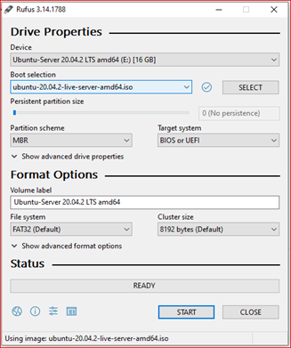

---
tags:
- ubuntu
- linux
- howto
aliases:
- Ubuntu 20.04 LTS Installation Guide
- Focal Fossa Installation Guide
---
# How to install Ubuntu Server 20.04 LTS
---
In this article we will demonstrate Ubuntu 20.04 LTS server installation steps (for raid 1 setup) with screenshots.

| Author | Email | Date | Summary |
| ------ | ----- | ---- | ------- |
| Vhulahani Manukha | manv.vhulie@gmail.com | 2021-06-11 | First Draft |
| Stephanus Schoeman | sschoeman94@gmail.com | 2021-08-11 | Edit: Removed unnecessary EFI, GUI and RAID steps |

---
## Contents
- [Requirements](README.md#requirements)
- [Instructions aasdf](README.md#instructions)
- [GUI Installation](README.md#gui-installation)
- [RAID Management](README.md#raid-management)

---
## Requirements
Before initiating the installation process, make sure that all of the minimum requirements are met for each of the items listed below.

- [Infrastructure](README.md#infrastructure)
- [Hardware](README.md#hardware)
- [Software](README.md#software)

---
### Infrastructure
These infrastructure components need to be available in order to perform this installation:
- Power
- Network

### Hardware
You will need the following hardware components:
- Bootable Media (default: USB Flash Disk)
- Server (default: SuperMicro)
    - At least 4 GB of memory
    - CPU with at least 2 cores
    - 2 x Hard Drive Disks of at least 25GB each
- Monitor
- Display cable (default: VGA)
    - Compatable with both monitor and server 
- Keyboard (default: USB)
    - Compatable with server
- Network cable (default: RJ45)
- 2 x Power cable (default: Kettle Plug)
    - Compatable with UPS if used

### Software
You will need the following software to complete the installation:
- [Rufus](https://rufus.ie) 
- [Ubuntu Server 20.04 LTS](https://ubuntu.com/download/server) ISO file
    - Select *Option 2 - Manual server installation*

---
## Instructions
The installation procedure consists of the following steps:

1. [Create bootable medium](#create-bootable-medium)
1. [Boot into the target system](#boot-into-the-target-system)
1. [Install the OS](#install-the-os)

---
### Create bootable medium
To complete this step, you will need the following:
- An installation of [Rufus](https://rufus.ie)
> ℹ **Info**
> 
> There are a multitude of tools available other than [Rufus](https://rufus.ie). You can even create bootable media manually from the command line, but [Rufus](https://rufus.ie) has proven to be robust and easy to use.
- A flash drive

Follow these steps:
1. Insert the flash drive into your PC.
1. Run the [Rufus](https://rufus.ie) executable.
1. Select the flash drive as the device you want to create the bootable medium on.
> ⚠ **Warning**
> 
> All data on the flash drive will be lost! Make sure to back up any valuable data on the flash drive before going on.
1. To select the [Ubuntu Server 20.04 LTS](https://ubuntu.com/download/server) ISO, click on the `SELECT` button next to the `Boot selection` dropdown list. Browse to, and select, the desired downloaded ISO file.
1. Under Partition scheme, select MBR.
1. Under Target system, select BIOS or UEFI.
1. Leave the rest of the settings in their default states. Your settings should look something like what's shown in *figure 1* below:
  **Figure 1.** _Screenshot of [Rufus](https://rufus.ie) settings._
1. Click on the `START` button.
1. You might see a `Download required` window appear. Click `Yes`.
1. After the missing libraries have been downloaded, you will see an `ISO Hybrid image detected` window appear, select the `Write in ISO Image mode (Recommended)` option, and click `OK`.
1. A window will now appear warning you that everything that is currently on that disk will be erased. After making sure there is nothing valuable on the flash drive, you can click `OK`.
1. Wait for Rufus to finish creating the Bootable Flash Drive, click the `CLOSE` button and safely remove the flash drive from your PC.

---
### Boot into the target system
1. Insert the Bootable Flash Drive into the target server on which you want to install Ubuntu Server 20.04 LTS.
2. Reboot the target system.
3. On reboot go into the Boot settings - `F11` on SuperMicro. 
4. Select as boot device the [bootable medium](<README.md#Create bootable medium>) you created earlier. Make sure to select the `UEFI: ...` option.
> ℹ **Info**
> If the `EUFI` option is unavailable, make sure that EUFI boot is enabled in the BIOS settings. If this does not solve the problem, make sure to *power off* the system completely and start the machine again - not *reboot*.
 
 ---
### Install the OS
Once the system boots up, we can start installing the new Operating System.

1. Navigate to the `Install Ubuntu Server` option using the arrow keys and press enter to select.
  **Figure 2.** _Screenshot of OS installation: Step 1._

1. Navigate to English (UK) and press enter.
  **Figure 3.** _Screenshot of OS installation: Step 2._

1. Choose the `English (South Africa)` keyboard layout, navigate to “Done” and hit enter.
  **Figure 4.** _Screenshot of OS installation: Step 3._

1. Configure the network.
  **Figure 5.** _Screenshot of OS installation: Step 4._
> ℹ **Info**
>
> You have three options:
> - Install without network connection
> - Use the default DHCP settings
> - Specify a custom network configuration for the server
> 
> Since all of these settings can be configured after installation, we will use the default DHCP settings for this document.
> If you install without network, the only difference will be that the server won't attempt to update and upgrade via the apt repository.

1. Specify the proxy address. Usually this can be left empty, but the system administrator can confirm.
  **Figure 6.** _Screenshot of OS installation: Step 5._

1. On the next screen, based on the location, the installer will automatically configure an Ubuntu archive mirror to use as the apt repository. You can change this to a local apt mirror if you have one deployed. Select “Done”.
  **Figure 7.** _Screenshot of OS installation: Step 6._

1. Select "Custom storage layout" when you reach the storage configuration step of the installer. Choose “Done” and hit Enter to proceed.
  **Figure 8.** _Screenshot of OS installation: Step 7._

1. If the disks have existing partitions, click on each disk under `AVAILABLE DEVICES` and then select `REFORMAT`. This will empty the partition table for the device.
  **Figure 9.** _Screenshot of OS installation: Step 8._

1. Navigate to the first device and press enter to open the dropdown menu. Navigate to the `USE AS BOOT DEVICE` option and press enter.
  **Figure 10.** _Screenshot of OS installation: Step 9._

1. Repeat the previous step for the second device and select the `USE AS ANOTHER BOOT DEVICE` option.
  **Figure 11.** _Screenshot of OS installation: Step 10._

1. Now create a partition to fill the remaining space on each of the drives. Navigate to the device, press enter, and select the `ADD GPT PARTITION` option.
  **Figure 12.** _Screenshot of OS installation: Step 11._

1. Leave the partition `unformatted` and `unmounted`. Navigate to the `CREATE` button and press enter.
  **Figure 13.** _Screenshot of OS installation: Step 12._
> 🔄 **Repeat**
>
> Do the same for both disks.

1. Identical partitions should now exist on the two drives. The next step is to mirror these two partitions by setting them up in a RAID 1 configuration. To do this, navigate to the `CREATE SOFTWARE RAID (MD)` option and press enter.
  **Figure 14.** _Screenshot of OS installation: Step 13._

1. A window will appear to configure the RAID 1 array.
    - Leave the name as `md0`.
    - Make sure to set the `RAID LEVEL` to `1 (mirrored)`.
    - Navigate to each partition and use spacebar to select.
    - Navigate to `CREATE` and press enter.
  **Figure 15.** _Screenshot of OS installation: Step 14._

1. Navigate to `md0 (new)` under `AVAILABLE DEVICES` and select the `ADD GPT PARTITION` option.
  **Figure 16.** _Screenshot of OS installation: Step 15._

1. Format the RAID 1 array with `ext4` and mount it at `/`.
  **Figure 17.** _Screenshot of OS installation: Step 16._

1. The storage configuration is now complete and should look something like shown in *figure 18* below. Navigate to `Done` and press enter.
  **Figure 18.** _Screenshot of OS installation: Step 17_

2. A window will pop up to confirm whether you want to persist your configuration. Select `Continue`.
  **Figure 19.** _Screenshot of OS installation: Step 18._
> ⚠ **Warning**
>  
> Up until this point, any data on the old drives can still be recovered easily. After pressing `Continue`, however, this becomes much more of a challenge. Make sure there is no data of value on the drives you're using!

1. Complete the profile setup for the system:
    - Use Engineer and engineer as your name and the username respectively.
    - Use `eda` as the password.
    - For the server name, pick a unique name for the host according to the theme used at the installation site.
    - Navigate to `Done` and press enter.
  **Figure 20.** _Screenshot of OS installation: Step 19._
> ℹ **Info**
> 
> Themes according to site:
> - SANAE VI: The Lion King
> - Marion Island: Norse Mythology
> - Hermanus: Game of Thrones

1. Select the `Install OpenSSH server` options and select `Done`.
  **Figure 21.** _Screenshot of OS installation: Step 20._

1. Don't install any featured server snaps. Select `Done` to continue.
  **Figure 22.** _Screenshot of OS installation: Step 23._

1. Wait for the installation to finish. If you have an internet connection, this step can take a while, since it will also apply all available apt upgrades.
  **Figure 23.** _Screenshot of OS installation: Step 22._

1. Once the installation has finished, navigate to the `Reboot Now` option and press enter.
  **Figure 24.** _Screenshot of OS installation: Step 23._

1. When prompted to remove the installation medium, remove it and press enter. The system should now reboot into the fresh Ubuntu Server 20.04 LTS installation.

## References
- [Ubuntu 20.04 LTS Server Installation Guide](https://www.linuxtechi.com/ubuntu-20-04-lts-server-installation-guide/)
- [Ubuntu 20.04 with software RAID1 and UEFI](https://alexskra.com/blog/ubuntu-20-04-with-software-raid1-and-uefi/)
