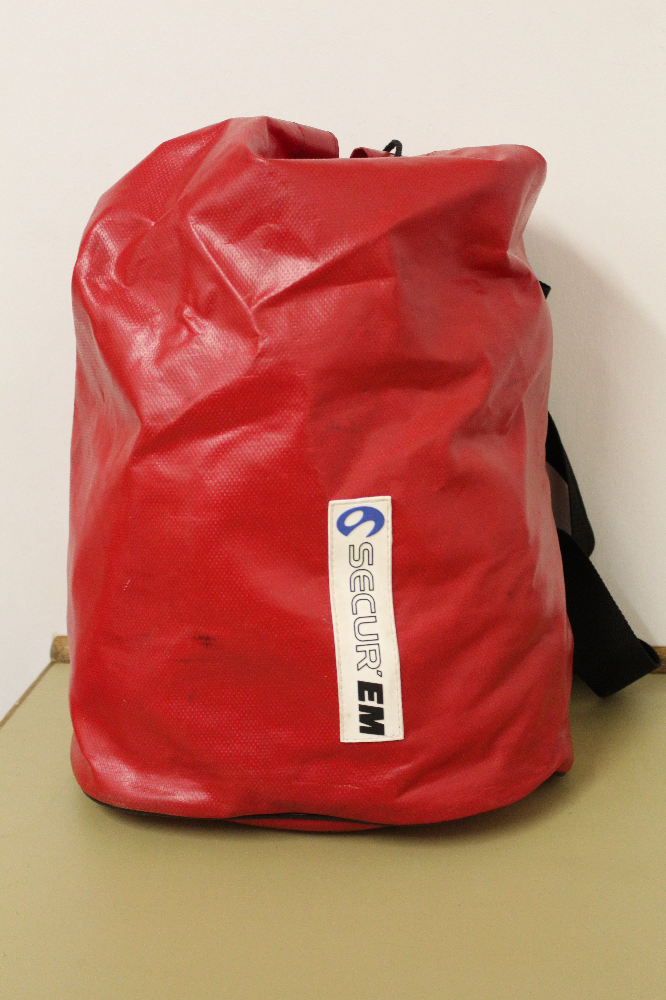
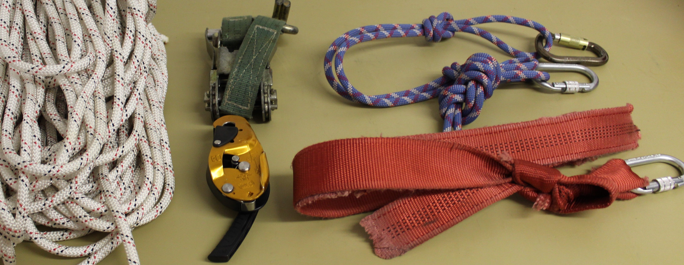
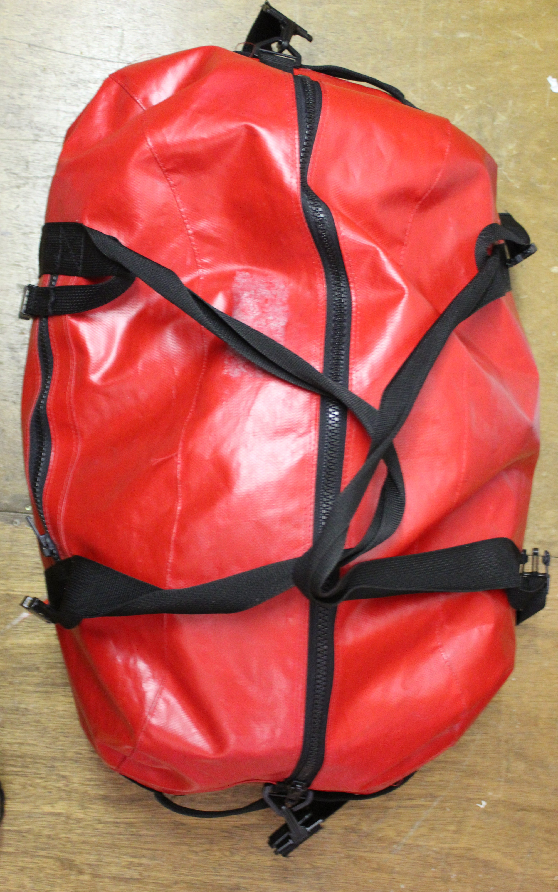
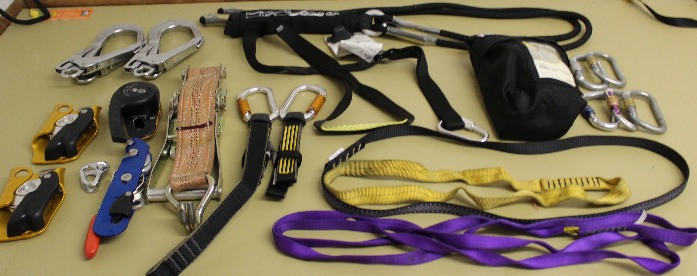
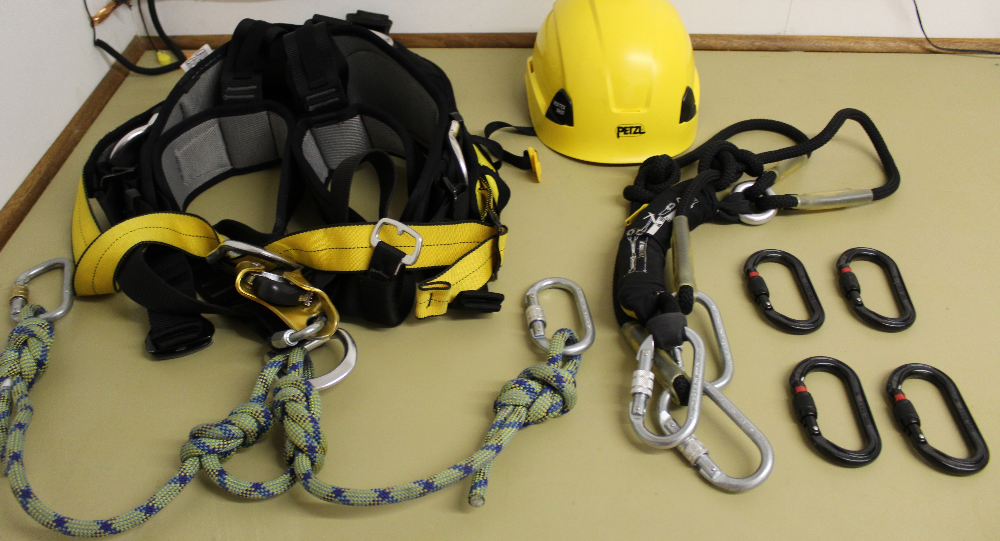
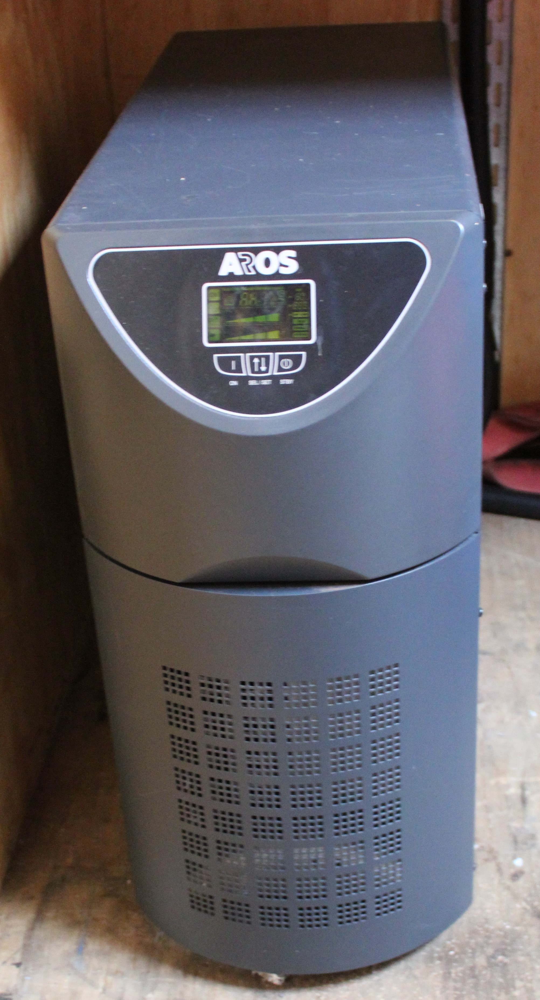
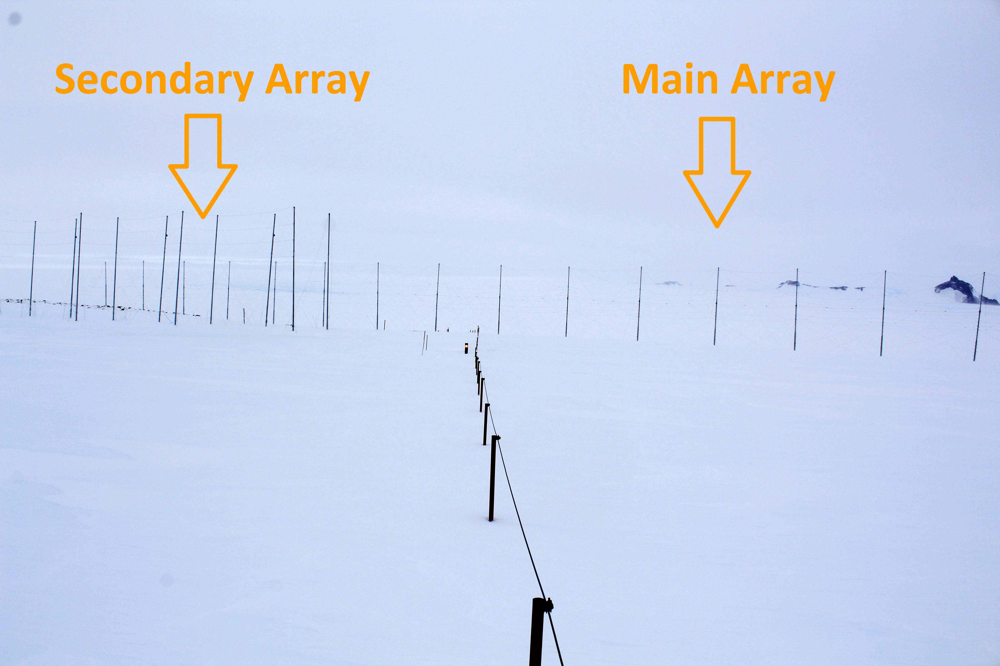

# Infrastructure

## Overview
The infrastructure of the radar and the maintenance thereof are discussed in depth [here](2_infrastructure.md). The radar's infrastructure consist of 20 antenna masts and a hut which houses all of the radar's transceiver and server equipment, as well as the network and electricity connection to the base infrastructure.

The radar hut is located about 600m South-East of the base at the center of the main antenna array, as shown in [figure 1](#figure-1-map-of-sanae-iv-science-area). There is a lifeline stretching from the base to the radar hut, as indicated on the map in [figure 1](#figure-1-map-of-sanae-iv-science-area).

The static infrastructure of the radar consists mainly of the radar hut and the 20 antenna masts with their stay ropes.

The radar hut contains emergency supplies, climbing gear, tools, various spare parts for the radar and has electricity relayed to it from the base.

Each antenna mast has eight stay ropes that keeps it upright. These ropes break from time to time and then needs to be repaired or replaced.

## Radar Hut
This section provides instructions for the maintenance of the radar hut and inventory lists of its contents.

The radar hut consists of two compartments: The lobby and the radar room, separated by a door. The lobby contains most of the supplies, while the radar room contains the radar hardware and a cabinet of some smaller spare components, stationary and miscellaneous items.

### Emergency Supplies
The radar hut is located about 600m from the base. This means that one can get stuck there if the weather changes abruptly and becomes unfavorable for traveling back to the base. Thus, the hut is stocked with emergency supplies for this eventuality. Supplies for medical emergencies are also necessary since the base is so far away.

It is the responsibility of the overwintering radar engineer to see that these supplies are always up to standard and not expired. See \tabref{infra_supplies} below for a comprehensive list of all supplies that need to be in the radar hut at all times:

###### Table 1. Radar hut emergency supplies - Food.
| Item | Description | Details |
| ---- | ----------- | ------- |
| Water | There is a dispenser in the hut. It needs to be cleaned and refilled regularly. | 20 Liters |  
| Canned food | A variety is preferable. Preferably instant meal type of things. Check expiry dates. | 10 cans |
| Instant soup | A variety is preferable. Check expiry dates. | 10 packs |
| Biscuits | Provitas, rusks, crackers, etc. Check expiry dates. | 4 packs |
| Fruit bars | A variety is preferable. Check expiry dates. | 1 box |
| Dried fruit | A variety is preferable. Check expiry dates. | 2 packs |
| Coffee | Instant coffee powder Check expiry date. | 500g |
| Tea | Preferably Rooibos and English. Check expiry date. | 20 bags |
| Condensed milk | Sweetened. Check expiry dates. | 3 cans |
| Game | Energy drink for restoring electrolytes. Check expiry dates. | 1 Can |
	
###### Table 2. Radar hut emergency supplies - Utensils.
| Item | Description | Details |
| ---- | ----------- | ------- |
| Electric kettle | Check that it's in a working condition. | 1 |
| Small electric stove | Check that it's in a working condition. | 1 |
| Plate | Check condition. | 1 |
| Cup | Check condition. | 1 |
| Other | Knife, fork, spoon, etc. | 1 set |

###### Table 3. Radar hut emergency supplies - Bedding.
| Item | Description | Details |
| ---- | ----------- | ------- |
| Mattress | Folded mattress. | 1 |
| Sleeping bag | Clean before takeover. | 1 |
| Pillow | New covers before takeover. | 2 |

###### Table 4. Radar hut emergency supplies - Medical.
| Item | Description | Details |
| ---- | ----------- | ------- |
| Medical aid kit | Give to doctor for restocking before takeover | 1 |
| Sun screen | Check quantities an expiry dates. | 2 tubes |
| Hand warmers | Unopened. Check expiry dates. | 4 pairs |

Furthermore, the fire extinguisher should also be checked on a regular basis. Make sure that the extinguisher is refilled during takeover when the DPW is servicing the rest of the fire extinguishers on base.

### Climbing Gear
Climbing gear for antenna maintenance is kept in the radar hut as well. This gear should be inspected on a regular basis according to standards provided during the working at heights training in Cape Town.

It is the responsibility of the overwintering radar engineer to ensure that the climbing gear is always ready to go and well maintained. See \tabref{infra_gear} for a list of all equipment that needs to be available.

###### Table 5. Radar Hut climbing gear - Rescue bag.
| Item | Description | Details |
| ---- | ----------- | ------- |
| Rescue bag | Smaller red tarp bag. | 1 |
| Dynamic climbing rope | Properly coiled in the red bag. | 1 |
| Ratchet or jag system | Make sure they're in a working condition. | 1 |
| Descender | - | 1 |
| Temporary slings | - | 2 |
| Carabiners | Attached to the slings | 4 |

###### Table 6. Radar Hut climbing gear - 2 Climbing sets.
| Item | Description | Details |
| ---- | ----------- | ------- |
| Helmet | Check that their in good condition. | 1 per set |
| Full harness | Inspect regularly. | 1 per set |
| Work belt | (Or 2 cow tails) Check condition. | 1 per set |
| Shock absorbing lanyard | Check condition. Use carabiners instead of hooks to prevent slipping off of ladder rungs. | 1 per set |
| Carabiners | For any other gear/equipment needed. | 4 per set |

###### Table 7. Radar Hut climbing gear - Other.
| Item | Description | Details |
| ---- | ----------- | ------- |
| Big red bag | Contains climbing sets and spares. | 1 |
| Climbing hooks | Not used, but could come in handy. | 4 |
| Descenders | Various types. | 4 |
| Ratchet | Spare for rescue set. | 1 |
| Shock absorbing lanyards | Various types and lengths. | 4 |
| Slings | Various lengths | 4 |
| Adjustable work belt | - | 1 |
| Carabiners | Spares | 5 |
| Jag system | Spare for rescue set. | 1 |
| Climbing sling | - | 1 |
| Helmet | Spare | 1 |

Otherwise, there are also a whole pile of old ropes removed from the radar that can be used as go-ropes. Be sure to take one with for climbing, this makes help from the ground much easier.

\figref{infra_rescue} shows what a rescue set should look like and what it should include.

###### Figure 1. A rescue set and its content.
| Rescue bag | Contents |
| - | - |
|  |  |

\figref{infra_climbing} shows what the climbing gear bag should look like and what it should include.

###### Figure 2. A climbing set and its content.
| Rescue bag | Contents |
| - | - |
|  |  |

\figref{infra_set} shows what a climbing set should look like and what it should include. There are hooks in the radar hut where these can be hung to make it quicker to get ready for climbing.

##### Figure 3. Gear a climbing set should include.

### Tools and Supplies
Any tools or materials necessary for routine maintenance on the radar should be available in the radar hut. If something breaks or is not available in the hut anymore, it should be added to the procurement list for the following takeover. \tabref{infra_tools} shows a list of the aforementioned tools.

###### Table 8. Radar Hut Tool List - Tools.
| Item | Description | Details |
| ---- | ----------- | ------- |
| Tool bag | Complete tool set. | 1 |
| Spanner sets | Two complete sets, imperial and metric. (Blue bag) | 2 |
| Big spanners | Two complete sets of large spanners, imperial and metric. (Against wall) | 2 |
| Metal strapping tool | For fastening metal straps. | 1 |
| Metal strapping | For tying the cable to the radar masts. See that there's enough. | 1 roll |
| Metal strapping sliders | For use with the metal straps. See that there's enough. | 1 box |

###### Table 9. Radar Hut Tool List - Cleaning Supplies.
| Item | Description | Details |
| ---- | ----------- | ------- |
| Bucket | For cleaning. | 1 |
| Cloths | One for cleaning and one for dishes. | 2 |
| Mr Min | For cleaning and wood cabinet. | 1 |
| Dish Soap | For cleaning dishes. | 1 |
| Brush | For cleaning. | 1 |
| Broom | For sweeping every now and again. | 1 |

###### Table 10. Radar Hut Tool List - Outside.
| Item | Description | Details |
| ---- | ----------- | ------- |
| Spade | For clearing snow. | 1 |
| Pry bar | For clearing hard ice. | 1 |

### Electricity
Electricity to the radar hut is supplied by the base. From there, it is also relayed to the Ozone Radiometer dome.

The power supplied to the radar is not on the base's UPS. There is a small UPS in the radar hut, however (see \figref{infra_ups}). This UPS only lasts about 5 minutes, just enough to properly switch off the radar. That means that the radar should be switched off as quickly as possible whenever the base looses power.

##### Figure 4. Small UPS located in the radar hut's lobby.

The distribution board is located in the radar hut, but shouldn't be tampered with by anyone other than the base electrical engineer or a certified electrician.

### Radar Parts
Spare parts for the radar that should be kept in the radar hut include the following:
- Spare rope for stay ropes and antennas.
- Thin coaxial cable the antennas are made of.
- Coaxial antenna cable that connects the antennas to the radar hut.
- A set of at least 4 spare antenna halves.
- Any other components needed to make more antenna halves.

Spare parts for the transceiver boxes can be kept in the radar hut if the servicing station was moved there for the winter, however they should be in the base if that is where radar boxes are being serviced.

## Radar Masts
The radar consists of two two antenna arrays: The main and secondary arrays. You can see both of them in \figref{infra_radar} below.

##### Figure 5. The main and secondary arrays of the radar.

### Main Array
The 16 masts supporting the main antenna array are held up by stay ropes. These ropes need to be maintained at all times. The masts in the main array are equipped with rungs for climbing to do repairs.

Whenever maintenance is being done, proper procedure should be followed. Refer to the SANSA fall protection plan for more details. Training for working at heights is mandatory and at least two trained persons must be present when maintenance is being done. At least one qualified person should be geared up and on the ground while anyone is climbing, in case it is necessary to perform a rescue.

### Secondary Array
The 13 masts supporting the 4 secondary array antennas are held up by stay ropes. These also need to be maintained at all times. These masts are not equipped with rungs for climbing, so any repairs to these have to be done with the help of a crane CAT and cherry picker basket.

Proper safety procedures for this have to be followed too. They are similar to that for climbing, so refer to the fall protection plan again for more details.

Please note that the secondary array antennas are not currently installed, but that the masts and stay ropes need to be maintained in any case to prevent any damage to the infrastructure.