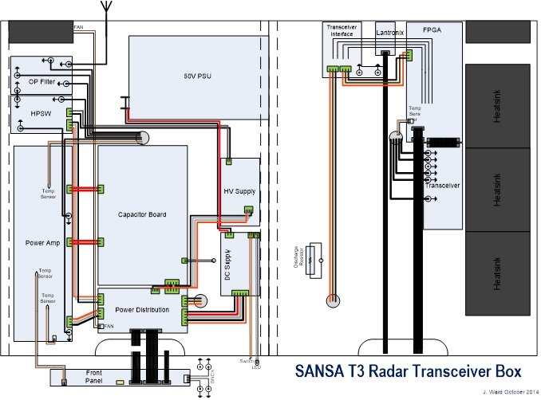

# Introduction
This manual serves as a comprehensive guide to maintaining the SuperDARN high frequency radar at SANAE IV. This section of the manual provides a concise background on the SuperDARN Radar, how it works and what it looks for.

## Infrastructure Overview
The infrastructure of the radar and the maintenance thereof are discussed in depth [here](2_infrastructure.md). The radar's infrastructure consist of 20 antenna masts and a hut which houses all of the radar's transceiver and server equipment, as well as the network and electricity connection to the base infrastructure.

The radar hut is located about 600m South-East of the base at the center of the main antenna array, as shown in [figure 1](#figure-1-map-of-sanae-iv-science-area). There is a lifeline stretching from the base to the radar hut, as indicated on the map in [figure 1](#figure-1-map-of-sanae-iv-science-area).

###### Figure 1. Map of SANAE IV science area.

Electricity is relayed from the base to the radar hut, from where it is also distributed to the small satellite dome where the ozone radiometer is located. The power is not connected to the base UPS's, so the radar has its own small UPS. For more information on the radar hut, refer to [this](2_infrastructure.md#radar-hut).

There is 20 antenna masts forming part of the radar infrastructure on which the antennas are mounted. See [here](#infrastructure.md#masts) for more details on the maintenance and climbing of these masts.

## Hardware Overview
The hardware of the radar and the maintenance thereof is discussed in depth in [this document](3_hardware.md). The radar has a main antenna array consisting of 16 antennas and a secondary array with 4 antennas. Each of these antennas is driven by a transceiver box, interconnected by the radar's server network.

The antennas are hexagonal and consist of two halves, as shown in [figure 2](#figure-2-a-radar-antenna) below. \subsecref{hw_antennas} provides more details on the construction and maintenance of the antennas.

###### Figure 2. A radar antenna.

[This section](hardware.md#transceiver-boxes) provides step-for-step instructions on the servicing and maintenance of the radar's transceiver boxes. \figref{intro_box} shows the basic layout for the front and back of a radar transceiver box.

The configuration of the server and network setup is demonstrated in the diagram shown in \figref{intro_hw}. The local radar network consists of a timing, control and monitoring network. The server is also connected to the base's science network and thus also the internet. More details concerning the maintenance of the server network can be found in \subsecref{hw_network}.

###### Figure 3. Radar transceiver box layout.

###### Figure 4. Network layout of the radar hardware.

## Software Overview
The radar's various software components are discussed in depth in [Software](4_software.md). The radar has several components that requires their own specialized software:
- RST - Radar control software installed on the radar server
- VHDL code installed on the T3 FPGA Board
- C Code installed on the Front Panel processor
- VHDL code installed on the HPSW FPGA

The RST software is mostly written in C and was developed to produce a standard data product for all SuperDARN radars. All of the source code is available, but rarely gets updated or changed. See \subsecref{sw_rst} for more information.

The VHDL source code for the T3 FPGA board isn't fully available, but is currently being adapted to allow for operation of the secondary array too. The file for reprogramming the board is available, should one of them start giving problems. See \subsecref{sw_fpga} for more details.

C code for the Front Panel's Zilog processor is available and will need to be updated from time to time. This code is responsible for monitoring the state of each transceiver box: On the Front Panel LCD as well as remotely via the server's monitoring network. Refer to [this section](4_software.md#front-panel) for more details.

The high power switches have a small CPLD installed on them for monitoring, control and communication purposes. The VHDL code for these chips are available, but shouldn't require any changes. Should one of the boards give problems, they can be reprogrammed. Refer to \subsecref{sw_hpsw} for more details.

## Standard Operating Procedures Overview
[Operations](5_operations.md) gives detailed information about the standard operating procedure for the radar. This includes instructions for daily checks to be performed, operating the radar, monitoring the radar's performance and generating monthly reports.

\subsecref{ops_summary}, \subsecref{ops_dailychecks} and \subsecref{ops_procedures} provide all of the information necessary for the radar's everyday operations.

\subsecref{ops_monitoring} provides details on the remote monitoring system implemented for all of the instruments. The Grafana monitoring software works on an influxDB back-end.

\subsecref{ops_reporting} gives instructions and information on the automatic reporting software used to generate a skeleton for each monthly report.