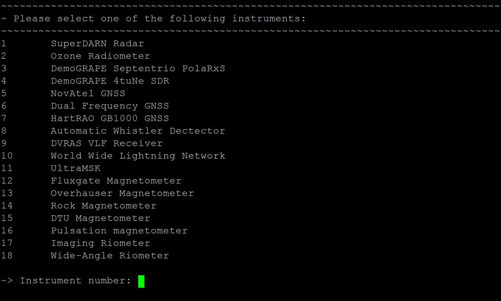
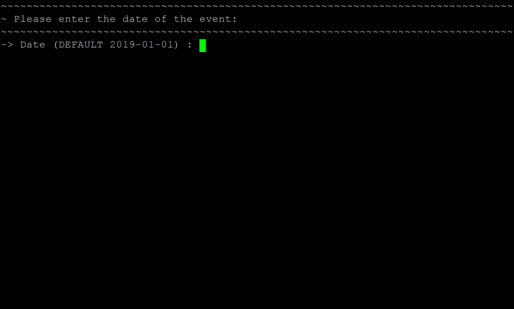

# Deleting a maintenance activity
To delete a faulty activity entry, run the script: `del.sh` and follow the instructions, as demonstrated by the following steps:

1. First, the script will display an enumerated list of all the registered systems. It will then prompt for an instrument number, corresponding to the instrument on which the activity is to be logged. Enter the number and then press the `Enter` key.

    ###### Figure 7. Deleting an activity: Step 1.
    

1. When asked for the date, once again a default value is displayed. The default date is that of the present day and if the event occurred on a previous day, that date should be entered in the correct format.

    ###### Figure 8. Deleting an activity: Step 2.
    

1. The script will then display an enumerated list of all the activities logged for the date previously specified. Enter the number corresponding to the faulty entry and press `Entry` to delete that entry. Wait for the logs to be synchronized with the instrument PC and influxDB database.

    ###### Figure 9 Deleting an activity: Step 3.
    