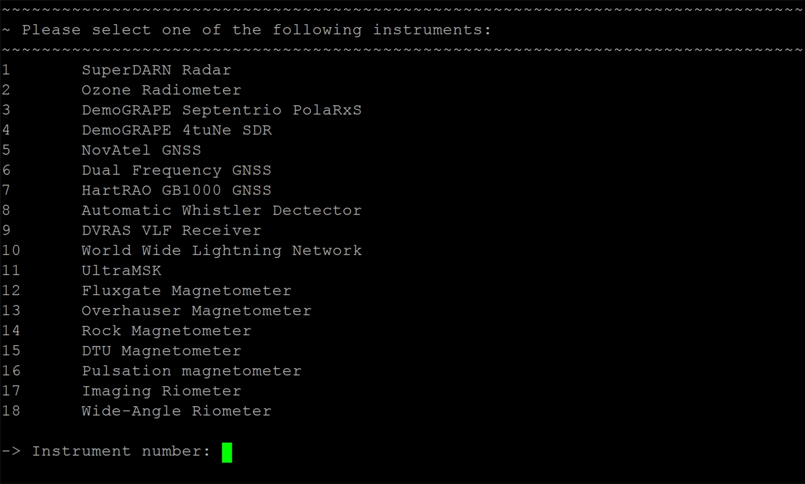
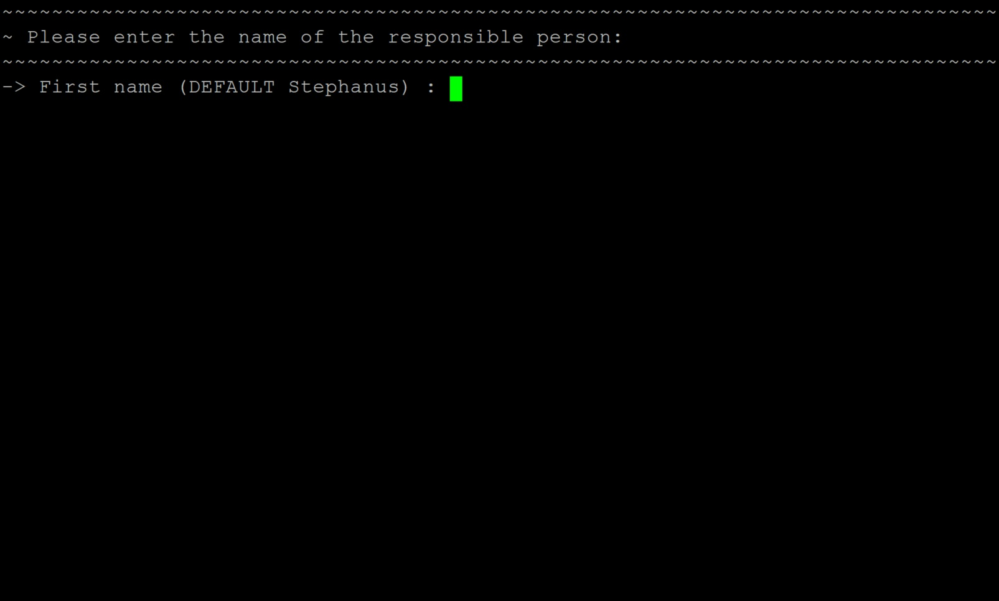
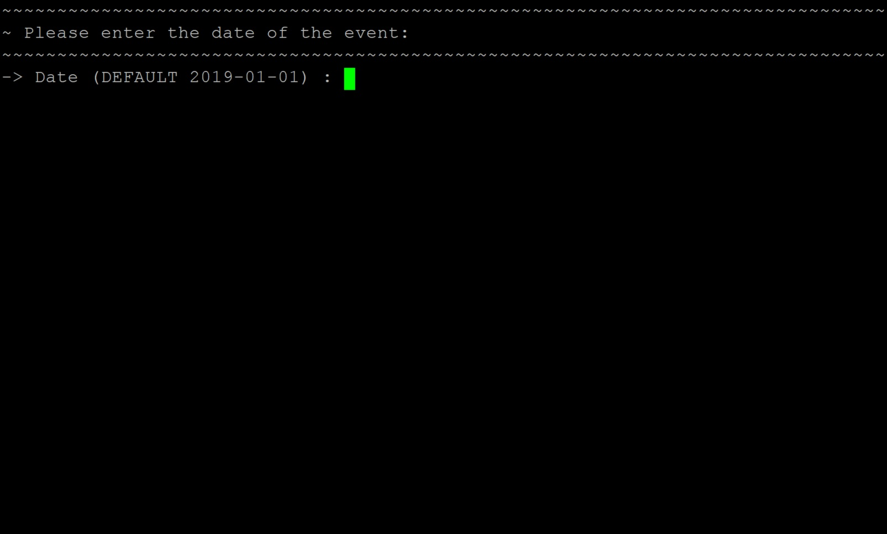
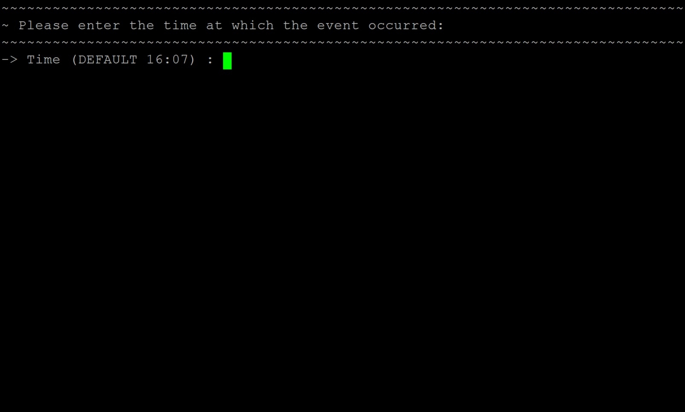
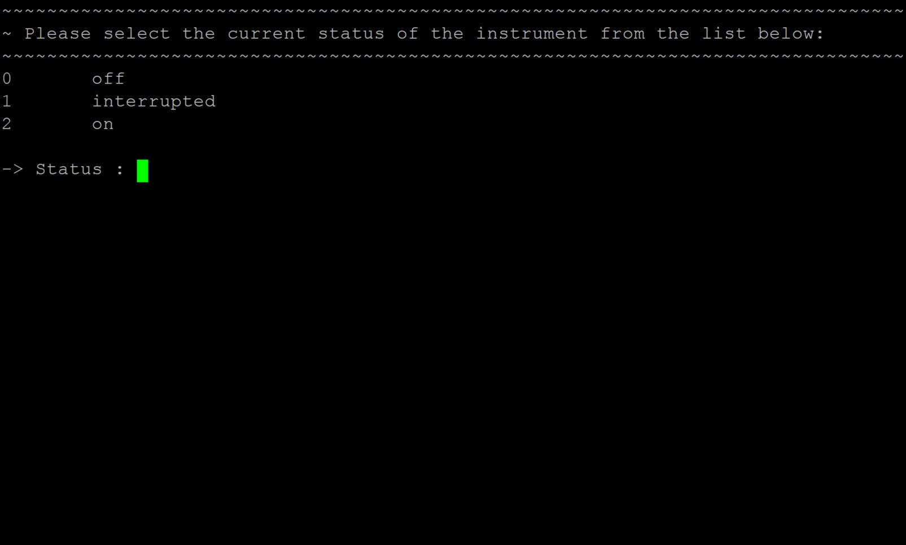
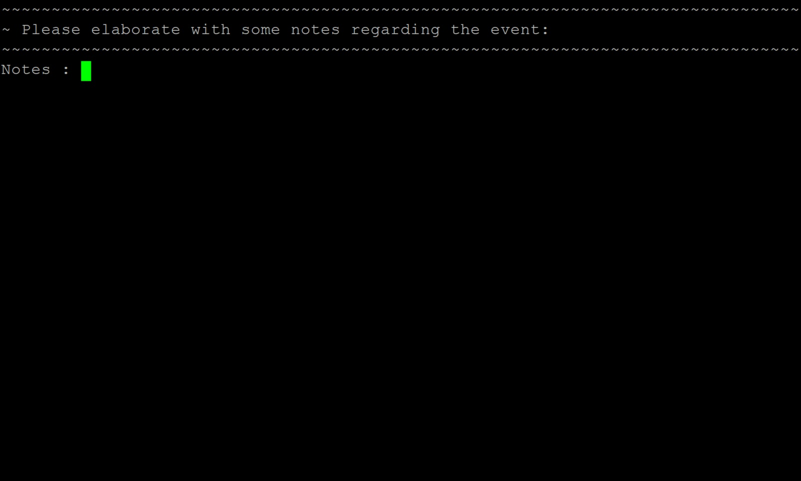

# Logging a maintenance activity
To log a new activity, run the script: `log.sh` and follow the instructions, as demonstrated by the following steps:

1. First, the script will display an enumerated list of all the registered systems. It will then prompt for an instrument number, corresponding to the instrument on which the activity is to be logged. Enter the number and then press the `Enter` key.
    ###### Figure 1. Logging a new activity: Step 1.
    

1. The next prompt will ask for the name of the person responsible. A default name is displayed, which is read from the universal configuration file. To select the default option provided, simply press the `Enter` key. If the default name is incorrect, type in the desired name and press `Enter`.
    ###### Figure 2. Logging a new activity: Step 2.
    

1. When asked for the date, once again a default value is displayed. The default date is that of the present day and if the event occurred on a previous day, that date should be entered in the correct format.
    ###### Figure 3. Logging a new activity: Step 3.
    

1. The time is then prompted, once again with the current time as default. Press `Enter` or type in the desired time for the event.

    ###### Figure 4. Logging a new activity: Step 4.
    

1. The new status of the system can then be selected from a list of options. These include 0 (the system is off and no data is being logged), 1 (the system is logging data, but interference caused it to be invalid) and 2 (the system is up and logging valid data). Select one of these options and press `Enter`.

    ###### Figure 5. Logging a new activity: Step 5.
    

1. Finally, the user is asked to elaborate on the reason behind the event. Provide as much information as possible, typing in full sentences. Avoid using special characters as part of this entry. When done, press `Enter` and wait for the logs to be synchronized and uploaded to the influxDB database.

    ###### Figure 6. Logging a new activity: Step 6.
    